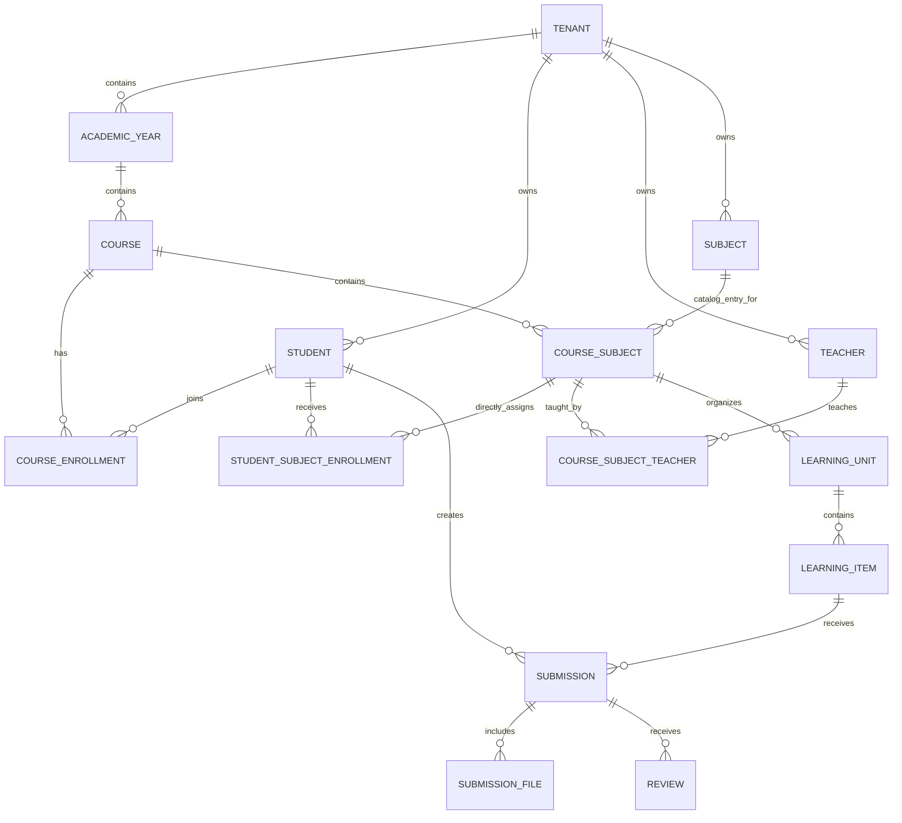

# Domain model

Status: reconciled conceptual model; not a Prisma schema

## Bounded contexts

| Context | Owns | Does not own |
| --- | --- | --- |
| Identity | Users, credentials, sessions, refresh tokens, memberships, roles, invitations, authentication audit, minimal `TenantRealm` references | Students, teachers, courses, subjects, tenant academic configuration, payments, grades |
| Tenant configuration | Académico tenant lifecycle, tenant settings, theme tokens, and the canonical ecosystem tenant ID reference | Identity credentials, Identity membership state, and academic work owned by other contexts |
| Academic structure | Academic years, courses, students, teachers, subjects, enrollments, subject-teacher assignments | Authentication and learning content |
| Learning | Learning units and typed learning items, publishing, ordering, item attachments | Identity and payment records |
| Work and review | Submissions, submission files, reviews, comments, change requests | Grades and automatic evaluation |
| Platform services | Notifications, delivery attempts, integrations, operational audit | The source domain records being notified |

## Relationship overview

## Entity rules

- Every tenant-owned entity has an internal identifier and an immutable canonical ecosystem `tenantId`.
- The Académico tenant record and Identity `TenantRealm` are service-owned records that use the same opaque ecosystem tenant ID; they are not shared tables or foreign-key relationships.
- External identifiers are stored as explicit references, not as primary keys.
- Soft deletion, archival, or status transitions must be chosen per aggregate; no global deletion convention is assumed.
- Creation and update timestamps use a consistent timezone strategy once approved; API dates are ISO 8601.
- Domain records should not contain credentials, password hashes, refresh tokens, invitation/activation secrets, or payment details.
- Student and Teacher records may store an optional stable `identityUserId` external reference. Académico explicitly initiates and owns that link; Identity never creates or owns the academic record.
- A `CourseSubject` joins one Course to one reusable Subject within the same tenant.
- CourseSubjectTeacher, StudentSubjectEnrollment, LearningUnit, and LearningItem relationships target CourseSubject rather than the reusable Subject catalog.

## Aggregate candidates

These are boundaries for implementation discussion, not a final persistence design:

- **Tenant**: tenant configuration and theme tokens.
- **Academic year**: lifecycle of a year and its courses.
- **Course**: course membership and its CourseSubject defaults.
- **Subject**: reusable catalog metadata only.
- **CourseSubject**: course-specific teaching context, teacher assignments, student direct enrollments, and learning-unit ordering.
- **Learning unit**: ordered learning items and visibility state.
- **Learning item**: typed content and work configuration.
- **Submission**: the student work record, files, comments, and review history.

Cross-aggregate operations should use application services and explicit transactions/events rather than hidden database coupling.

## Deliberate omissions

No grade, rubric, attendance, question, exam-attempt, or guardian-relationship entity is part of the MVP model. Future features may add them behind new bounded-context decisions.
