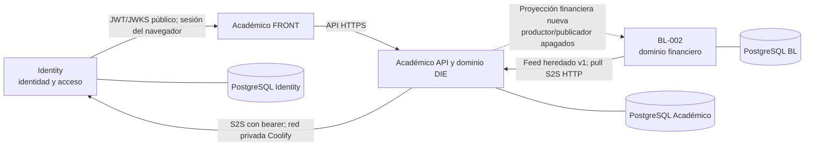

# Arquitectura del ecosistema EduPay

Estado documental: mapa transversal vigente al **2026-09-24**. La fotografía
operativa verificable está separada de la arquitectura objetivo. No se comprobó
Coolify en esta edición; para runtime rigen las verificaciones fechadas que se
enlazan abajo.

## Entrada rápida y estado al 2026-09-24

### Responsabilidad por dominio

| Proyecto | Es dueño de | Fuera de su responsabilidad |
| --- | --- | --- |
| [EduPay Identity](https://github.com/Sherydans12/edupay-identity) | Cuentas, credenciales, sesiones, memberships, roles de tenant, invitaciones, activación y auditoría de identidad. | Personas, permisos académicos por recurso, datos DIE y finanzas. |
| EduPay Académico (este repositorio) | Alumnos/docentes académicos, estructura y matrícula académica, aprendizaje y DIE; aplica autorización académica con contexto confiable de Identity. | Credenciales/sesiones de Identity, cobros/pagos de BL y acceso directo a las bases de otros servicios. |
| [BL-002 / EduPay Pagos](https://github.com/Sherydans12/BL-002) | Operación y registros financieros: cobros, pagos, asignaciones, comunicaciones y portal financiero; conserva autenticación administrativa propia. | Identidad Académico, matrícula académica canónica y expedientes DIE. |

Las bases y los registros de tenant son independientes. El UUID de tenant es un
identificador lógico intercambiado por contratos autenticados, nunca una FK
entre bases. La transición de ownership documentada es una dirección aceptada;
las propuestas de migración y convergencia siguen requiriendo su propio cambio
y autorización.

### Integraciones desplegadas y límites actuales



- **Identity → Académico:** el navegador usa el servicio público de Identity;
  la API Académico valida JWT asimétricos con JWKS. Las comprobaciones
  restringidas de sesión, vínculo exacto y personal DIE salen de la API por la
  red privada Coolify, con bearer S2S server-only. No hay acceso de Identity a
  las tablas académicas. Contratos: [Identity API](https://github.com/Sherydans12/edupay-identity/blob/main/docs/architecture/api-contracts.md),
  [ADR-0010 Identity](https://github.com/Sherydans12/edupay-identity/blob/main/docs/decisions/ADR-0010-academico-restricted-service-auth.md)
  y [ADR-0009 Académico](../decisions/ADR-0009-identity-contract-reconciliation.md).
- **BL-002 → Académico (heredada):** el worker Académico hace pull autenticado
  del feed v1 BL de cursos, alumnos y relación vigente alumno–curso. Lee BL por
  HTTP y persiste su propia proyección; no conecta al PostgreSQL BL. El último
  inventario de release DIE registra ambos workers Académico detenidos antes de
  la ventana y sin cambios durante ella; no asumir sincronización continua.
  Fuente: [implementación del sync](../integration/edupay-sync-implementation.md)
  y [descubrimiento v1](../integration/edupay-sync-discovery.md).
- **Académico → BL (proyección nueva):** contratos de productor/publicador,
  consumer shadow y snapshots están implementados y la preparación de esquema
  consta en los cierres; producer, publisher y shadow permanecen **apagados**.
  No hay backfill ni uso para decisiones financieras. Es una integración
  distinta del pull heredado BL → Académico. Fuente: [contrato y límites](../integration/academic-financial-projection.md),
  [decisión de release apagado](../deployment/phase1-financial-projection-release-decision.md)
  y [ADR-0021](../decisions/ADR-0021-ecosystem-domain-ownership-transition.md).
- **DIE → BL:** no existe conexión ni feed DIE a BL. Expedientes, datos sensibles
  y resultados DIE quedan en Académico y se excluyen de toda proyección
  financiera. Véase [ADR-0023](../decisions/ADR-0023-die-sensitive-record-boundary.md).

### Git comprobado ahora y runtime verificado más recientemente

El **2026-09-24** se actualizó `origin` con Git y se crearon worktrees limpios
desde estos `origin/main`; esos SHAs son referencias de código/documentación,
no commits de build ni prueba de runtime:

| Repositorio | `origin/main` comprobado ahora | Estado local preservado |
| --- | --- | --- |
| Académico | `6543c2456caa7f7bfbf6630eb78c6751f32dba28` | Checkout `main` previo en `c86facb`, 51 commits detrás, limpio. |
| Identity | `57b8827008c4a7b92c60a435b3fb1bc4f7554492` | Checkout local seguía en rama feature con cambios; no se tocó. |
| BL-002 | `d3e40da0bcf893e8d02f2c23d7c79a4d46b8071f` | Checkout local `main` en `502e646`, 24 commits detrás y con cambios locales; no se tocó. |

La comparación Git de BL entre `04687aa` (corte de release documentado) y
`origin/main` actual muestra cambios sólo en cuatro archivos
`docs/operations/*`. Esto no confirma qué artefacto sigue corriendo.

La última verificación de runtime disponible en Git está fechada **2026-09-24**
en el [cierre DIE](../operations/die-release-closeout-2026-09-24.md) y el
[inventario Coolify](../operations/coolify-inventory.json): Identity API,
Académico API y FRONT DIE quedaron `running:healthy`; Identity conserva 4
migraciones y Académico 13. El FRONT Académico activo es
`cct0rtf5iku6fkd3t9hldnv4`, fijado al digest
`sha256:c117c718352ede7220f4f685711d7df4bc88384b304bb19970d9379aa9fc0d81`;
el frontend anterior `qf65r4ltig6jhb6t8dmv2qyw` quedó detenido y conservado. El
auto deploy es manual. El piloto DIE no está configurado ni validado con
usuarios reales. Esta edición documental no vuelve a comprobar ese runtime.

| Recurso Coolify | Aplicación → dominio | Repositorio / rama | Commit fuente del build | Artefacto desplegado según la última fotografía |
| --- | --- | --- | --- | --- |
| `cct0rtf5iku6fkd3t9hldnv4` | Académico FRONT → `academico.edupay.baselogic.cl` | `edupay-academico`, imagen aprobada | `bd413666ebb3674dc791d8cb735bcea1aadbed62` | `sha256:c117c718352ede7220f4f685711d7df4bc88384b304bb19970d9379aa9fc0d81` |
| `qf65r4ltig6jhb6t8dmv2qyw` | FRONT anterior, sin dominio → conservado detenido | `edupay-academico`, rama histórica | `4f5ad2839e08e561e0335f6e4fdedfe448f15415` | Aplicación anterior; referencia de rollback del FRONT |
| `iobfkpujjoa2kj5urbpnjvzi` | Académico API → `academico-api.edupay.baselogic.cl` | `edupay-academico`, servicio pinned | `bd413666ebb3674dc791d8cb735bcea1aadbed62` | `sha256:902c5e2ed1aa59d4e2ca7e6a558aaa113585b3737fc6ed4346bb6597531ac393` |
| `0vrvqepcukwcubxga0narorf` | Identity API → `identity.edupay.baselogic.cl` | `edupay-identity`, servicio pinned | `93418b68eaf41976b4bc695039afcbc8eab4fdbc` | `sha256:960d326a9199881d54c7fc9611d052be77c0fbdceae4badebfe1208febe5aa01` |
| `nn8yrhitex2r6squev0auwrs`, `r8mtn1xqtex96j4a8wu5hae6` | Workers de notificación y sync → sin dominio público | `edupay-academico`, mismo servicio/API image | `b2f489f3bfbb67da8fc8ff71be7ea551e1de27c9` | `sha256:b3e45d7c0afad1729947bdea6fe16d517c3dc9060891b38b313ce14a0548084a`; ambos detenidos en el snapshot |
| `ktgdely86kx0by10p9cb91os` | BL-002 FRONT → `edupay.baselogic.cl` | `BL-002`, rama `main` | `502e6463464de0a54b440362a64da0c31450818f` | Digest no consignado en el inventario transversal |
| `km0aljzabdiqtaixj9dsequu` | BL-002 BACK → `api-edupay.baselogic.cl` | `BL-002`, rama `main` | `16e208af6a50e5703bc8f6edd51d7ff11b9c6381` | `sha256:85b202901f77a60cb120f0cc720b878f54e0e570da4d8c191d3040ee511ef64f` |

En esta tabla, rama configurada, commit fuente del build e imagen/digest son
datos distintos. `origin/main` comprobado el 24/09 arriba no sustituye ninguno
de los datos de build. UUID, imagen íntegra, PostgreSQL, flags y healthchecks
están en el [inventario transversal](../operations/coolify-inventory.json);
el BL mantiene además su fotografía propia del 15/09, marcada como histórica.

### Reglas de release y recuperación

- Identity y Académico usan recursos **PostgreSQL nativos de Coolify** (15 para
  sus DBs); BL usa su PostgreSQL nativo (18). Las bases antiguas de Compose
  `edupay-pilot` no son el destino de los procesos productivos. La lectura
  segura del destino real y la reconciliación están en [el informe DB](../operations/die-database-target-reconciliation-2026-09-24.md).
- Las migraciones productivas del 24/09 corrieron en migradores **inmutables
  fijados por digest**: Identity terminó con 4 y Académico con 13 migraciones.
  El migrador Identity anterior que carecía de `schema-engine` quedó retirado.
  No se reejecuta la cadena histórica ni se infiere destino por el nombre del
  contenedor; no hay autorización general para próximas migraciones.
- El FRONT se publica como imagen por digest y con auto deploy manual. Sus
  `NEXT_PUBLIC_API_BASE_URL` y `NEXT_PUBLIC_IDENTITY_BASE_URL` son configuración
  pública incluida al construir el bundle; los tokens internos y secretos se
  mantienen sólo en backend y Coolify. Un cambio web se libera por su recurso,
  no redeployando el monorepo entero.
- Los workflows de PR/main son de validación. Los workflows de publicación de
  migradores requieren `workflow_dispatch`, y Coolify reporta auto deploy
  manual/desactivado en los recursos citados. Por eso un merge documental a
  `main` no inicia un deployment; una promoción de imagen sigue siendo manual.
- El rollback se decide por recurso: FRONT, API/servicio y worker tienen
  artefactos y healthchecks propios. Para el FRONT anterior, reasignar el
  dominio con un solo router activo. No borrar DBs ni revertir migraciones para
  recuperar la aplicación. Cuando existan expedientes DIE, volver a una API
  anterior sólo es admisible tras verificar que puede tolerar esas tablas y
  datos; el rollback de imagen no revierte el esquema ni autoriza borrar datos.
- En la vista Coolify General de Identity y Académico persistía el aviso de
  campos sin guardar durante el corte. No se guardó ni reseteó: conciliar el
  estado antes del siguiente deploy/rollback, como indica el backlog.

BL conserva su [registro directo de despliegue del 2026-09-15](https://github.com/Sherydans12/BL-002/blob/main/docs/operations/PRODUCTION.md)
y su inventario fechado en esa misma fecha. El inventario transversal Académico
del 2026-09-24 es la referencia más reciente disponible para recursos
compartidos; las dos fotografías tienen fechas y finalidades distintas.

### Pendientes operativos y trabajo aparcado

El orden siguiente es de dependencia operativa, no una priorización de negocio.

| Proyecto | Estado | Siguiente acción | Criterio de cierre |
| --- | --- | --- | --- |
| Académico + Identity — piloto DIE | Pendiente; módulo desplegado, perfil y equipo de prueba no configurados; sin usuarios reales validados. | Seguir [guía de primer uso](../operations/DIE-PILOT-GUIDE.md) con tenant y personal autorizados; registrar validación real por rol sin introducir expedientes ficticios. | Perfil institucional completo y flujo/acceso confirmado por usuarios del tenant previsto; registrar evidencia y límites. |
| Académico + Identity — formulario Coolify | Aviso de campos sin guardar en General de ambos recursos durante la verificación del 24/09; no se guardó ni reseteó. | Antes del próximo redeploy/rollback, comparar campos con el runtime y resolver el aviso sin guardar cambios en bloque. | Configuración del recurso revisada y cambios intencionales guardados por separado; inventario fechado actualizado. |
| Académico — próximo cambio de esquema | Ledger y efectos históricos necesitan reconciliación; no hay autorización general de migraciones. | Probar catálogo/ledger en clon, revisar respaldo actual y proponer el cambio específico conforme a [rehearsal](../deployment/prisma-reconciliation-rehearsal.md). | Evidencia de clon y backup para el cambio concreto, decisión y autorización registradas antes de una migración productiva. |
| BL-002 — backup vivo y uploads | La restauración del backup PostgreSQL protegido se verificó en el cierre anterior; consistencia completa de DB viva y cobertura integral de uploads siguen sin certificarse. | Completar comprobación independiente de backup/restore para DB viva y archivos cuando se programe el siguiente corte. | Restore aislado documentado cubre DB y uploads requeridos y se registra fecha, fuente y límites. |
| BL-002 ↔ Académico — mapping canónico | UI desplegada según cierre BL; se registraron 0 escrituras reales de mapping en el corte del 15/09. | Sólo al autorizar el uso de esa conexión: validar tenant y ejecutar dry-run antes de escribir el mapping. | Mapping explícito verificado para el tenant autorizado, con auditoría y prueba del contrato; no inferido por nombre/RUT. |
| BL-002 — proyección financiera | En pausa: producer, publisher y shadow apagados; tablas/contratos no significan activación. | Mantener desactivado; tratar cualquier activación como cambio separado con contrato, datos, flags, credenciales, migración y autorización revisados. | Sólo un release autorizado y documentado con pruebas y gates propios; hasta entonces permanece apagado. |
| BL-002 — rollover 2026–2027 y cambios locales | Trabajo local no integrado; no se promovió al desplegar el mapping. | Conservarlo aparcado; una propuesta nueva debe partir de revisión de ownership con Académico y estado Git limpio/revisable. | Decisión explícita de destino/alcance y PR revisado; ningún cambio local se considera aceptado por estar documentado. |
| Todos — otros cambios locales no integrados | Permanecen ramas, worktrees y cambios locales fuera de `origin/main`; este cierre los preservó. | Al seleccionar trabajo, inspeccionar el worktree/branch concreto y comparar con `origin/main`; no promoverlo en bloque. | PR revisado e integrado, o decisión explícita del dueño para mantenerlo aparcado; no se descartan cambios por este cierre. |
| Académico — mejoras futuras | No se seleccionó trabajo funcional nuevo para esta fase de cierre. | Elegir una mejora desde [roadmap](../product/roadmap.md), [decisiones pendientes](../governance/unresolved-decisions.md) y backlog del dominio, sin convertir propuestas en decisiones. | Alcance y criterios acordados; documentación/ADR afectada revisada antes de implementar. |

### Punto de entrada para el próximo cambio Académico

1. Leer este mapa, [límites de agentes](../governance/agent-boundaries.md),
   ADRs aceptados y el runbook de la superficie afectada.
2. Crear worktree propio desde `origin/main` actualizado; conservar otros
   worktrees y cambios locales.
3. Implementar el cambio limitado al dueño de dominio y probar según el riesgo
   y las instrucciones de ese repo.
4. Actualizar contrato, inventario, runbook o ADR cuando cambie una frontera,
   autenticación, ownership, persistencia o comportamiento operativo.

### Fuentes autoritativas

| Tema | Fuente de detalle |
| --- | --- |
| Operación conjunta, recursos Coolify y migraciones DIE | [cierre DIE](../operations/die-release-closeout-2026-09-24.md), [inventario](../operations/coolify-inventory.json) y [reconciliación de destino DB](../operations/die-database-target-reconciliation-2026-09-24.md). |
| Despliegue, restore y rollback Académico | [PRODUCTION](../operations/PRODUCTION.md), [RUNBOOK](../operations/RUNBOOK.md), [PHASE-CLOSEOUT](../operations/PHASE-CLOSEOUT.md), [backup/restore](../deployment/backup-restore.md). |
| Identity | [índice](https://github.com/Sherydans12/edupay-identity/blob/main/docs/README.md), [runbook de release DIE](https://github.com/Sherydans12/edupay-identity/blob/main/docs/operations/die-release-authorization-runbook.md) y [contratos](https://github.com/Sherydans12/edupay-identity/blob/main/docs/architecture/api-contracts.md). |
| BL-002 | [índice](https://github.com/Sherydans12/BL-002/blob/main/docs/README.md), [producción](https://github.com/Sherydans12/BL-002/blob/main/docs/operations/PRODUCTION.md), [runbook](https://github.com/Sherydans12/BL-002/blob/main/docs/operations/RUNBOOK.md) y [cierre](https://github.com/Sherydans12/BL-002/blob/main/docs/operations/PHASE-CLOSEOUT.md). |
| Contratos y arquitectura aceptada Académico | [índice de docs](../README.md), [ADRs](../decisions/README.md), [sync heredado](../integration/edupay-sync-implementation.md), [proyección apagada](../integration/academic-financial-projection.md). |

## Auditoría arquitectónica histórica — 2026-09-03

La sección y matrices existentes debajo conservan el análisis de arquitectura
objetivo, rollover y transición realizado el 03/09. Sus afirmaciones de estado
operativo reflejan esa fecha y no reemplazan la fotografía fechada del 24/09 de
esta entrada. La decisión aceptada y sus contratos siguen vigentes salvo una
decisión posterior enlazada en los ADRs.

## Propósito y alcance

Este documento registra el estado comprobado de EduPay Identity, EduPay
Académico y EduPay Pagos/BL-002, la arquitectura objetivo y una transición sin
big bang. Es el documento transversal del ecosistema: cada servicio conserva
su propia documentación de implementación y sus propias decisiones locales.

La decisión no altera retrospectivamente los hechos ni los contratos de
compatibilidad de ADR-0015 y ADR-0016. Sustituye la **dirección futura de
ownership** de esos ADRs; sus requisitos de seguridad, paginación,
idempotencia, snapshots y reconciliación siguen siendo válidos.

### Evidencia revisada

| Servicio       | Estado revisado                                                                               | Evidencia principal                                                                                                                   |
| -------------- | --------------------------------------------------------------------------------------------- | ------------------------------------------------------------------------------------------------------------------------------------- |
| Identity       | checkout `feat/account-lifecycle-email-cors` en `8696588` (limpio)                            | `prisma/schema.prisma`, `docs/architecture/identity-architecture.md`, ADR-0001/0002/0006/0007/0010 y `src/internal-academic/`         |
| Académico      | `origin/main` en `6b5b46c`; el checkout principal estaba limpio, 26 commits detrás de ese ref | `apps/api/prisma/schema.prisma`, `apps/api/src/academic/`, `apps/api/src/sync/`, ADR-0015/0016                                        |
| Pagos / BL-002 | `main` en `502e646` con un bloque local grande sin commit; no hay cambios staged              | `backend/prisma/schema.prisma`, `backend/src/integrations/academico/`, módulos anuales locales y `docs/*ACADEMIC*`, `docs/*ROLLOVER*` |

La auditoría también revisó el worktree histórico de BL-002 en `abc3776`, que
contiene el contrato fuente v1, y los worktrees académicos de dominio y sync.
No se aplicó ninguna migración ni se escribió información de colegios.

## Estado actual comprobado

### Matriz de capacidades y fuentes reales

| Entidad/capacidad                     | Identity                                                 | Académico                                                              | BL-002 / Pagos                                                                          | Fuente real actual                                                                                                | Consumidores / observación                                                                                                            |
| ------------------------------------- | -------------------------------------------------------- | ---------------------------------------------------------------------- | --------------------------------------------------------------------------------------- | ----------------------------------------------------------------------------------------------------------------- | ------------------------------------------------------------------------------------------------------------------------------------- |
| Cuenta de identidad                   | `IdentityUser`, identificadores, credenciales y sesiones | referencia opcional `identityUserId`                                   | `User` local con contraseña y JWT propios                                               | Duplicada por límite histórico: Identity para el nuevo ecosistema; BL mantiene login administrativo independiente | Académico valida JWT/JWKS de Identity. BL aún no consume Identity.                                                                    |
| Persona básica                        | no existe agregado `Person` ni perfil humano separado    | nombre/contacto de Student/Teacher                                     | nombre/RUT/contacto de Student y Guardian                                               | No hay fuente única de perfil de persona                                                                          | No crear cuentas Identity obligatorias para alumnos o apoderados sin acceso.                                                          |
| Tenant                                | `TenantRealm.id` UUID lógico canónico                    | `Tenant.id` independiente con el mismo identificador lógico            | `Tenant.id` string local, por ejemplo un slug, más `TenantCanonicalMapping`             | Identity + Académico están alineados por contrato; BL tiene implementación Fase 1A sin filas desplegadas          | La equivalencia UUID de Identity/Académico ↔ tenant string de BL es explícita, 1:1 y no está conectada aún a contratos operacionales. |
| Membership y roles de acceso          | `TenantMembership`, roles tenant/plataforma              | consume claims y decide permisos de recursos académicos                | `User`–`Role`–`Permission` locales                                                      | Identity para Académico; BL para su panel existente                                                               | `SYSTEM_ADMIN` de Identity no hereda acceso tenant; BL usa `SUPER_ADMIN` local.                                                       |
| Alumno                                | ningún modelo académico                                  | `Student`, con vínculo opcional a Identity y procedencia manual/EDUPAY | `Student` financiero/administrativo legado                                              | Híbrida: el sync v1 hace a BL fuente de filas `source=EDUPAY`; Académico también admite filas manuales            | No existe todavía un maestro académico único operativo.                                                                               |
| Profesor                              | identidad/membership opcional                            | `Teacher`, asignaciones a CourseSubject                                | no hay modelo                                                                           | Académico                                                                                                         | El docente puede existir sin cuenta; al vincularse, Identity sólo valida la cuenta exacta.                                            |
| Curso / oferta                        | no                                                       | `Course` dentro de `AcademicYear`                                      | `Course` legado; el bloque local agrega oferta anual                                    | Híbrida: BL es upstream de sync v1; Académico es dueño de cursos manuales                                         | Los `Course.id` enteros de BL no son identidad interoperable.                                                                         |
| Asignatura / docencia                 | no                                                       | `Subject`, `CourseSubject`, `CourseSubjectTeacher`                     | no                                                                                      | Académico                                                                                                         | No está incluida en los feeds BL v1/v2.                                                                                               |
| Año académico                         | no                                                       | `AcademicYear` con ciclo DRAFT/ACTIVE/CLOSED/ARCHIVED                  | bloque local no aplicado crea `AcademicYear` DRAFT/OPEN/CLOSED/ARCHIVED                 | Académico en código desplegable; BL también pretende crearlo localmente                                           | Es el solapamiento arquitectónico más importante del rollover.                                                                        |
| Matrícula                             | no                                                       | `CourseEnrollment` curso–alumno, con estado y procedencia              | bloque local no aplicado crea `Enrollment` anual, movimientos e historial               | Académico tiene la relación operativa actual; BL v2 pretende publicarla como fuente                               | El sync v1 sólo representa la matrícula vigente derivada de `Student.courseId`.                                                       |
| Promoción / repitencia                | no                                                       | no hay agregado ni flujo de rollover implementado                      | bloque local no aplicado crea `PromotionRun`, `PromotionItem`, compensación y auditoría | BL local únicamente                                                                                               | El algoritmo es reutilizable, pero su aggregate debe pasar a Académico.                                                               |
| Apoderado / responsable financiero    | futura membership `GUARDIAN`, sin modelo de dominio      | no hay modelo Guardian                                                 | `Guardian` y relación actual con Student                                                | BL                                                                                                                | No confundir relación de cobro con identidad o matrícula.                                                                             |
| Obligación, cuota, pago, conciliación | no                                                       | no                                                                     | `Charge`, `Payment`, `PaymentAllocation`, conceptos, reportes y Portal                  | BL                                                                                                                | Éste es el bounded context financiero que debe permanecer en BL.                                                                      |

### Hechos de implementación que condicionan la transición

1. Identity ya separa credenciales, sesiones, membresías y roles de los
   registros académicos. Sus únicas rutas internas para Académico son la
   comprobación de sesión y la resolución exacta de un `IdentityUser`; no es un
   directorio general ni una API de mutación académica.
2. Académico posee esquemas tenant-safe para años, cursos, alumnos, docentes,
   asignaturas, relaciones de curso y matrícula; las FKs compuestas permanecen
   dentro de su propia base. Tiene API administrativa CRUD y worker de sync.
3. El consumidor actual de Académico sólo entiende el feed **v1** de BL:
   Course, Student y relación vigente Student–Course. Su configuración escoge
   un `AcademicYear` local para el feed y conserva watermarks, snapshots,
   leases, evidencia de conflictos y reconciliación.
4. BL conserva autenticación, usuarios, roles y tenants propios. No valida
   JWT/JWKS de Identity y su tenant string no está mapeado al UUID canónico.
5. El bloque local no aplicado de BL agrega `AcademicYear`, `AcademicLevel`,
   `Enrollment`, `EnrollmentMovement`, promoción, importación, auditoría y
   outbox; además implementa el feed anual **v2**. Sus migraciones están
   documentadas como pendientes y no se ejecutaron contra datos reales.

## Revisión del rollover 2026 → 2027 de BL-002

El trabajo no debe descartarse. Su separación correcta es la siguiente:

| Parte revisada                                                                                                                                    | Clasificación                                 | Destino recomendado                                                                                                                                                                          |
| ------------------------------------------------------------------------------------------------------------------------------------------------- | --------------------------------------------- | -------------------------------------------------------------------------------------------------------------------------------------------------------------------------------------------- |
| `AcademicYear`, `AcademicLevel`, oferta anual Course, `Enrollment`, movimientos, decisión de promoción/repitencia e historial                     | dominio académico                             | Migrar/adaptar a Académico. BL no debe ser su dueño final.                                                                                                                                   |
| `PromotionRun`, ítems con excepciones, control de versión, idempotency key, transacción serializable y compensación sin borrado                   | algoritmo académico reutilizable              | Extraer reglas y pruebas hacia un aggregate de rollover de Académico; conservar el diseño como referencia mientras no haya datos reales.                                                     |
| `Charge.academicYearId` / `enrollmentId`, `PaymentAllocation`, filtros financieros anuales, snapshots de comunicaciones y conciliación interanual | dominio financiero con referencias académicas | Permanecer en BL, pero reemplazar sus FKs a tablas académicas locales por IDs opacos procedentes de Académico cuando se haga el corte.                                                       |
| UUIDs de integración inmutables, secuencias monotónicas, HMAC cursor/watermark, snapshots completos, tombstones, paginación y límites             | infraestructura de integración reutilizable   | Conservar semántica y pruebas; implementar el siguiente contrato con Académico como productor, sin reutilizar BL como maestro.                                                               |
| `AuditEvent` y `OutboxEvent` transaccionales                                                                                                      | infraestructura transversal                   | Mantener la idea por servicio. BL necesita auditoría financiera; Académico necesita auditoría/Outbox académico propios. La auditoría local no reemplaza un publisher ni un contrato público. |
| v1 y v2 read-only de `/integrations/academico`                                                                                                    | compatibilidad temporal                       | v1 debe congelarse para consumidores existentes. v2 no debe activarse ni convertirse en contrato permanente antes de invertir la dirección.                                                  |

### Riesgos de activar las migraciones de BL ahora

- Consolidaría en Pagos la escritura y autoridad de año, matrícula, promoción,
  repitencia y estructura, en competencia directa con Académico.
- Haría que el consumidor académico tuviera que migrar otra vez de v1 a un v2
  cuyo productor seguirá siendo el servicio equivocado.
- Introduciría FKs académicas físicas en la base financiera y elevaría el costo
  de separar ownership posteriormente; los datos nuevos quedarían con doble
  historia potencial.
- La existencia de dos ciclos de estados (`OPEN` de BL frente a `ACTIVE` de
  Académico) y dos modelos de matrícula exige un mapeo explícito que aún no
  existe.
- No hay evidencia de un publisher que entregue los `OutboxEvent` de BL. Una
  fila de outbox por sí sola no produce sincronización confiable.

Por lo anterior se prohíbe, hasta una decisión de corte, ejecutar las
migraciones `20260902120000_add_academic_year_foundation` y
`20260902130000_add_academico_v2_sequences` fuera de una base aislada. Esto no
cuestiona sus pruebas ni invalida los artefactos; evita convertir un puente de
migración en el nuevo sistema de registro.

## Arquitectura objetivo propuesta

### Fuente de verdad por dominio

| Dominio                                                                                                       | Fuente de verdad objetivo             | Réplicas permitidas                                                                  |
| ------------------------------------------------------------------------------------------------------------- | ------------------------------------- | ------------------------------------------------------------------------------------ |
| Cuenta, credencial, sesión, identificador de acceso                                                           | EduPay Identity                       | claims de token de corta vida; nunca contraseñas ni refresh tokens fuera de Identity |
| Tenant canónico, membership y roles de aplicación                                                             | EduPay Identity                       | registros locales de tenant con el mismo ID opaco y mapeos de integración auditados  |
| Perfil de persona asociado a una cuenta                                                                       | EduPay Identity, cuando exista cuenta | snapshots mínimos donde haya necesidad legal u operativa                             |
| Alumno, profesor y su ciclo académico                                                                         | EduPay Académico                      | proyección financiera mínima en BL                                                   |
| Año, nivel, sección, curso anual, asignatura y asignación docente                                             | EduPay Académico                      | proyección read-only en BL para segmentar cobros y reportes                          |
| Matrícula, traslado, promoción, repitencia e historial                                                        | EduPay Académico                      | referencias inmutables/proyecciones de elegibilidad en BL                            |
| Responsable financiero, consentimiento de cobro, obligación, cuota, pago, conciliación y reportes financieros | EduPay Pagos / BL-002                 | identificación mínima de alumno/año/curso procedente de Académico                    |

### Course: concepto arquitectónico y modelo físico

En esta documentación, “oferta anual” describe el concepto de un curso dentro
de un año académico. **No es una nueva entidad física.** El modelo real de
Académico ya es `Course`, con `academicYearId`, y debe seguir siendo el único
aggregate/identificador de curso anual. En los contratos se usará
`academicCourseId`, no `academicCourseOfferingId`.

### Relaciones canónicas

```text
IdentityUser ──< TenantMembership >── TenantRealm
      │                         │
      │ opcional, exacta         └── roles de acceso
      ▼
Academic Student / Academic Teacher ──< Academic Enrollment >── Academic Course ── AcademicYear
      │
      └──< FinancialResponsibleParty / FinancialObligation (BL)
              │
              └── identityUserId opcional, sólo si ese responsable inicia sesión
```

- `IdentityUser` representa identidad de cuenta. No debe crearse para cada
  alumno, docente o apoderado si no requiere acceso.
- `AcademicStudent` y `AcademicTeacher` son entidades de negocio independientes
  y pueden apuntar opcionalmente a un `identityUserId` opaco. Identity no crea
  ni borra esos registros.
- `TenantMembership` autoriza entrar a una aplicación; no es matrícula ni
  asignación docente. Académico aplica además sus reglas de recurso.
- El responsable financiero pertenece al agregado financiero de BL. Puede
  vincularse a un IdentityUser para un portal futuro, pero la relación de
  responsabilidad y el historial de cobro no se trasladan a Identity ni a la
  matrícula.
- Si se requiere una persona sin cuenta compartida entre dominios, se abre un
  ADR específico para un perfil de persona mínimo en Identity. No se infiere
  identidad por nombre, RUT o email ni se bloquea el primer corte esperando ese
  agregado.

### Reglas de identificadores

1. El ID canónico del tenant es el UUID opaco de Identity y se replica como
   valor de integración en Académico y en `TenantCanonicalMapping` de BL. Esa
   tabla tiene PK `tenantId` local y `canonicalTenantId` único, además de actor,
   correlación, motivo y fecha de alta. Nunca es una FK entre bases ni un valor
   autorizado desde el cliente.
2. Cada servicio usa sus propios IDs internos. Los contratos llevan IDs opacos
   del productor, por ejemplo `academicStudentId`, `academicYearId`,
   `academicCourseId` y `academicEnrollmentId`.
3. BL mantiene sus IDs numéricos legados mientras existan pagos/boletas que los
   referencien. Agregará una tabla de mapeo/proyección, no una reutilización de
   IDs académicos como PKs financieras.
4. Las claves de idempotencia y los event IDs son estables por productor. Un
   consumidor debe deduplicar por `(producer, tenantId, eventId)` y conservar
   versión/origen para rechazar actualizaciones obsoletas.

## Dirección de integraciones

### Identity → Académico

- Validación síncrona de JWT por JWKS para solicitudes ordinarias.
- Comprobación interna y acotada de sesión/membership para acciones de alto
  riesgo, y resolución exacta para vincular una cuenta a un alumno/docente.
- Eventos de Identity pueden avisar activación, revocación o cambio de
  membership, pero no sustituyen la autorización en línea para operaciones
  sensibles.
- Académico nunca lee la base de Identity ni almacena secretos de Identity.

### Académico → Pagos

Académico debe convertirse en el productor de una proyección financiera
deliberadamente escasa: tenant canónico, alumno académico, año, oferta/curso,
matrícula, estado/decisión y cambios de elegibilidad. No incluirá credenciales,
notas, entregas, apoderados, RUT ni información pedagógica innecesaria.

Usar ambos mecanismos. Su diseño inicial, aún no implementado, está en
[Academic → Financial Projection](../integration/academic-financial-projection.md):

- un snapshot/pull paginado y versionado para bootstrap, recuperación y
  reconciliación nocturna;
- eventos desde un outbox académico para baja latencia, con entrega al menos una
  vez, idempotencia, versión de entidad y correlación.

BL debe proyectar localmente sólo lo indispensable para originar obligaciones,
segmentarlas y conservar comprobantes. Un cambio de curso o una baja no borra
pagos ni obligaciones previas. El contrato futuro debe ser nuevo y nombrado
por su dirección, por ejemplo `Académico → Financial Projection`; no se debe
reinterpretar silenciosamente `EduPay → Académico v1` ni `v2`.

### Transiciones y consistencia

- Las bajas, traslados y promociones se emiten desde Académico con estado,
  fecha efectiva, versión y event ID. BL actualiza su proyección de manera
  eventual y mantiene el snapshot que originó cada obligación.
- Una obligación no se elimina por una baja posterior; la política financiera
  decide cancelar, recalcular o mantener deuda mediante una acción financiera
  auditada.
- El rollover se confirma en Académico; sólo después se emiten cambios de
  matrícula que BL consume. Pagos no promueve alumnos.
- Para fallos, los eventos se reintentan y un snapshot completo repara drift.
  Ningún consumidor aplica bajas por ausencia sin un snapshot completo y su
  regla documentada de reconciliación.

## Onboarding multi-colegio propuesto

La coordinación es una saga de APIs/operadores, no una transacción ni acceso
directo entre bases.

| Etapa                  | SYSTEM_ADMIN / BaseLogic                                                 | TENANT_ADMIN / directivo                                              | Sistema dueño                                                 |
| ---------------------- | ------------------------------------------------------------------------ | --------------------------------------------------------------------- | ------------------------------------------------------------- |
| Contratación y tenant  | asigna UUID canónico, crea realm/mapping y registra soporte/auditoría    | —                                                                     | Identity coordina realm; cada servicio crea su registro local |
| Administrador inicial  | ejecuta bootstrap/invitación de Identity y registra correlación          | activa cuenta y elige contraseña                                      | Identity                                                      |
| Tenant académico       | crea tenant académico independiente con UUID canónico                    | verifica contexto y permisos                                          | Académico                                                     |
| Estructura inicial     | acompaña, carga plantilla y revisa errores                               | crea año, niveles/ofertas/cursos y asignaturas                        | Académico                                                     |
| Personas y cuentas     | soporte sólo con elevación auditada                                      | crea/importa alumnos y docentes; decide qué personas requieren cuenta | Académico + Identity para las cuentas                         |
| Matrículas y docencia  | revisión de progreso                                                     | matricula, asigna docente–curso–asignatura y valida                   | Académico                                                     |
| Preparación financiera | configura conceptos/reglas de cobro después de recibir proyección válida | revisa proyección y reglas aplicables                                 | BL                                                            |
| Habilitación           | revisa checklist, integraciones y reconciliación                         | confirma colegio listo                                                | coordinador de onboarding                                     |

El onboarding debe tener un `OnboardingRun` reanudable y auditado por tenant,
pasos idempotentes, validación previa, archivos de importación conservados de
forma segura, errores por fila, resultados parciales y claves de reintento. La
primera versión puede ofrecer importación CSV/XLSX en Académico sin bloquear la
arquitectura por un importador completo. No se debe usar el importador
financiero de BL para crear autoridad académica nueva.

## Rollover anual correcto

Académico conserva por separado persona/cuenta, alumno, oferta de curso,
matrícula anual e historial:

1. Configura el `AcademicYear` de destino y sus ofertas/cursos, niveles,
   secciones, asignaturas y asignaciones docentes en borrador.
2. Genera un `RolloverRun` académico idempotente que produce ítems revisables
   para promoción, repetición, retiro, traslado e ingreso. No modifica la
   matrícula de origen.
3. Al confirmar, cierra o completa la matrícula de origen según su estado y
   crea una matrícula nueva de destino. Repetir significa apuntar a una oferta
   del mismo nivel; promocionar, a la oferta del nivel siguiente.
4. Conserva movimientos, decisión, actor, correlación y justificación. La
   reversión se hace por compensación semántica, nunca por borrado físico.
5. Publica eventos/proyecciones de las matrículas confirmadas a BL. Las cuotas
   y pagos de 2026 continúan ligados a sus snapshots; los de 2027 nacen con
   las referencias de 2027.

La lógica de excepciones, bloqueo de concurrencia, idempotencia, auditoría y
compensación del bloque de BL es la candidata principal para este aggregate.
Antes de copiar código se debe adaptar su vocabulario y sus estados al modelo
de Académico (`ACTIVE`, `CLOSED`, `ARCHIVED`) y comprobar que la migración no
introduzca una segunda relación de matrícula.

## Plan de transición incremental

| Fase                                                | Objetivo y repositorios                                   | Compatibilidad / pruebas                                                                                                          | Rollback                                                                                                                              |
| --------------------------------------------------- | --------------------------------------------------------- | --------------------------------------------------------------------------------------------------------------------------------- | ------------------------------------------------------------------------------------------------------------------------------------- |
| 0. Congelar la dirección                            | Documentar esta decisión; BL, Académico, Identity         | No ejecutar migraciones de rollover BL ni backfill; conservar v1 y el worktree local                                              | N/A, sólo documentación                                                                                                               |
| 1A. Canonical Tenant Mapping                        | BL, con Identity y Académico como referencias de contrato | **Implementado en worktree aislado**: mapeo explícito, único, idempotente y auditado; `dryRun`, conflicto y pruebas cross-tenant  | La migración aditiva permanece sin aplicar; el mapping queda sin uso por contratos productivos y no modifica PKs ni datos financieros |
| 1B. Académico → Financial Projection Contract       | Académico, BL                                             | **Implementado en worktree aislado**: contrato Zod v1, OpenAPI, fixtures y contract tests; endpoints fallan cerrados sin S2S      | Retirar artefactos de contrato no desplegados sin datos de negocio                                                                    |
| 1C. Financial Projection Producer + Shadow Consumer | Académico, BL                                             | **Implementado en ramas aisladas, no activado:** outbox/snapshot S2S en Académico y projection/ledger/reconciliación shadow en BL | Deshabilitar el consumer y conservar evidencia/proyección de sólo lectura                                                             |
| 2. Completar administración académica               | Académico, Identity                                       | Año/oferta, alumnos, docentes, asignaturas, matrículas y carga reanudable bajo tenancy; pruebas de autorización e idempotencia    | Mantener creación manual; no redirigir aún BL                                                                                         |
| 3. Llevar rollover a Académico                      | Académico                                                 | Portar reglas del `PromotionRun` como nuevo aggregate, pruebas de promoción/repetición/traslado/compensación e historial          | No confirmar run; compensación semántica de un run confirmado                                                                         |
| 4. BL consume proyección                            | Académico, BL                                             | Snapshot inicial, outbox/eventos, consumer idempotente, reconciliación y shadow comparison con el feed BL v1                      | Detener consumer y conservar proyección/mapeo de sólo lectura; no borrar datos legados                                                |
| 5. Cortar autoridad de BL                           | Académico, BL                                             | Académico crea años/ofertas/matrículas; BL bloquea escritura académica nueva y sólo mantiene proyección/read compatibility        | Rehabilitar lectura v1 sólo durante ventana documentada; nunca reescribir historia                                                    |
| 6. Retirar compatibilidad legada                    | BL, Académico                                             | Retención, export, conciliación financiera y aprobación formal antes de remover modelos/endpoints legados                         | Restauración lógica desde backups y proyecciones, no reset destructivo                                                                |

### Convergencia futura de autenticación de BL

La autenticación propia de BL (`User`, contraseña, roles y JWT) es
compatibilidad histórica, no el estado objetivo. No forma parte de 1A–1C ni se
modifica en este corte. Después de estabilizar la proyección financiera, la
transición será:

```text
BL autenticación local
→ coexistencia con Identity
→ BL valida confianza/claims de EduPay Identity
→ retiro controlado de usuarios, passwords, JWT y roles duplicados
```

La fase requerirá un ADR propio, compatibilidad explícita para el Portal
financiero legado, migración de sesiones/roles aprobada y una ventana de
rollback. No autoriza federación improvisada, cookies compartidas ni cambios a
la base de Identity.

El corte de producción exige migraciones aisladas, backup restaurable, dry-run,
reconciliación por tenant y aprobación explícita. No se permite un big bang ni
una migración cruzada de bases.

## Estado de los cortes 1A–1C

La Fase 1A se implementa en un worktree BL propio. Su migración sólo crea una
tabla vacía; no hace backfill y no se aplicó a una base real. El endpoint de
configuración exige `SUPER_ADMIN`, no permite reasignar, normaliza el UUID y
ofrece `dryRun=true` para validar existencia y colisiones sin crear una fila.
Identity continúa siendo la única autoridad del UUID: el cliente no puede
elegirlo como contexto de una operación financiera futura.

Fase 1B quedó implementada como artefactos de contrato y declaración OpenAPI
en un worktree propio. Fase 1C añadió producer y shadow consumer en ramas
separadas. Ninguna migración fue ejecutada, ningún secreto fue configurado y
ningún dato real fue sincronizado. El flujo disponible, pero inactivo, es:

```text
Académico CourseEnrollment + versión durable
  └─ misma transacción → outbox académico → HTTP S2S at-least-once
      └─ BL TenantCanonicalMapping → proyección shadow aislada
          └─ ledger/cuarentena/snapshot/reconciliación (sin Payments/Charges)
```

La siguiente implementación **no autorizada aún** es:

1. Completar Administración/Onboarding académico con tenancy, alta explícita
   y configuración operable por colegio antes de introducir ciclos masivos.
2. No conectar aún BL como consumidor de producción ni como fuente financiera.
   Puede mantener la proyección shadow solamente tras una activación explícita
   y reconciliación por tenant.
3. Mantener el rollover 2026→2027 de BL intacto; su port a Académico requiere
   un corte/ADR propio y no forma parte de 1C.

Este corte invierte la dirección futura sin tocar el historial financiero ni
ejecutar las migraciones académicas locales de BL. El port de rollover es el
corte siguiente, no el primero.

## Criterios de aceptación de la decisión

- Los tres repositorios referencian este documento o una decisión equivalente
  antes de cambiar ownership, contratos o migraciones.
- Se mantiene independencia de bases, autenticación y secretos.
- Los contratos prueban tenant mapping, duplicados, replay, orden obsoleto,
  tombstones, snapshots parciales, dos tenants y ausencia de PII financiera o
  académica no requerida.
- Se prueba que alumnos/docentes sin cuenta y responsables financieros sin
  membership continúan siendo válidos.
- La migración de un tenant piloto produce conciliación exacta de cantidad de
  alumnos/matrículas, obligaciones, pagos y saldos antes de ampliar el alcance.
