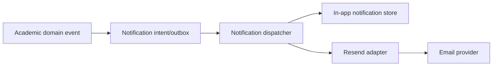

# Notifications

Status: proposed application notification layer

## Design goal

Domain behavior should emit notification intents without knowing whether delivery is in-app, email, or a future channel. Resend is an infrastructure adapter, not a domain dependency.

## Candidate flow

## MVP notification candidates

- A new assignment or assessment is published to an assigned student.
- A deadline is approaching, if reminder timing is approved.
- A submission is received by the assigned teacher.
- A submission is reviewed.
- Changes are requested.
- A resubmission is received.
- An invitation is issued or accepted through Identity.

The final event catalog, recipients, email copy, and reminder timing are unresolved.

## Reliability rules

- The domain transaction records the intent; delivery failure must not roll back the academic action.
- Delivery is idempotent by event/recipient/channel/template key.
- Retries use bounded backoff and expose a terminal failure state.
- In-app notifications are tenant-scoped and unread/read state is per recipient.
- Email delivery uses a Resend adapter with provider response IDs and sanitized error details.
- Provider webhooks, if used, are authenticated and mapped to the correct tenant/event without trusting arbitrary tenant input.

## Preferences and privacy

Per-user channel preferences are a likely follow-on. Until decided, the system should have a clear default and a supportable opt-out path for non-essential email. Notification content must minimize student data and avoid embedding sensitive file content.

## Unresolved decisions

- Queue/worker implementation and operational ownership.
- Whether notification preferences are required for MVP.
- Email sender domains and tenant-specific sender/reply-to behavior.
- Whether all in-app notifications are retained indefinitely or expire.
