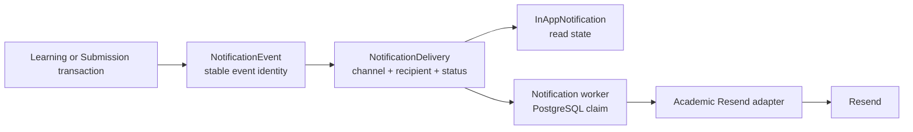

# Notifications

Status: accepted MVP architecture; detailed by [ADR-0014](../decisions/ADR-0014-academic-notifications-and-delivery.md)

## Ownership and boundaries

EduPay Académico owns operational academic notifications only. EduPay Identity
continues to own invitation, activation, password-recovery, and authentication
email delivery, secrets, credentials, and its own outbox. Académico never
stores Identity email secrets or calls Identity email workflows.

Academic recipients are resolved from tenant-scoped active Student or Teacher
records with an explicit `identityUserId` link. A missing link is observed as a
skipped delivery; no recipient is invented.

## Transactional flow

The academic mutation and event/delivery intent commit together. Resend is
never called inside the request transaction. In-app display rows are created
transactionally because they have no external dependency; email deliveries
remain pending for the worker.

## Durable models

- `NotificationEvent` stores tenant, event type, aggregate identity, safe
  template payload, `occurredAt`, `notBefore`, correlation/request ID, and a
  deterministic stable event ID.
- `NotificationDelivery` stores tenant, event, recipient key, opaque Identity
  user reference, academic email snapshot when available, channel, template
  version, unique idempotency key, attempt/lease timestamps, provider message
  ID, and sanitized failure/skip state.
- `InAppNotification` stores only recipient-scoped display fields: type, title,
  short body, safe target path, event identity, created time, and nullable
  read time. It never stores file bytes or unnecessary submission text.

All tenant-owned notification rows use tenant-composite keys/foreign keys.
Identity tables are never referenced directly.

## Worker and delivery states

The worker is `pnpm --filter @edupay/api worker` and uses the same API modules
against PostgreSQL. It claims `PENDING`/`RETRY` rows and expired
`PROCESSING` leases with `FOR UPDATE SKIP LOCKED` semantics, then delivers in a
bounded batch. It defaults to five-second polling, batches of fifty, five
attempts, and bounded backoff of approximately 1m/5m/15m/1h/6h. A terminal
failure is `FAILED`; work is not retried forever.

Provider failures are safe to retry only when categorized as transient. Worker
crashes leave `PROCESSING` work reclaimable after the lease. The database
unique idempotency key prevents duplicate application delivery, and the
provider message ID is retained for operator reconciliation.

The worker can materialize due scheduled LearningItem publication events. A
scheduled item remains read-time visible when its `publishAt` has elapsed even
if no worker is running; no notification is sent before the effective time.

## MVP event catalog

| Event | Recipient | Channel |
| --- | --- | --- |
| `ASSIGNMENT_PUBLISHED` | eligible students | in-app + email |
| `ASSESSMENT_PUBLISHED` | eligible students | in-app + email |
| `SUBMISSION_RECEIVED` | active assigned teachers | in-app |
| `RESUBMISSION_RECEIVED` | active assigned teachers | in-app |
| `SUBMISSION_REVIEWED` | submitting student | in-app + email |
| `CHANGES_REQUESTED` | submitting student | in-app + email |

Eligible means active CourseSubject access through default course enrollment
or direct StudentSubjectEnrollment, and active Teacher assignment for teacher
events. `COMMENTED` alone is not a notification event. Announcement
publication may create in-app notifications only. Material publication,
deadline reminders, chat, and ordinary content-change email are out of scope.

## Email copy and configuration

Spanish `v1` templates include only activity/subject title, due date or review
status, and a safe deep link. The Academic Resend adapter uses the independent
`ACADEMIC_*` environment variables. Test mode uses a fake adapter and never
contacts Resend.

## API

The current trusted principal can use:

- `GET /api/v1/notifications?cursor=&limit=`;
- `PATCH /api/v1/notifications/:notificationId/read`;
- `POST /api/v1/notifications/read-all`;
- `GET /api/v1/notifications/unread-count`.

The list is cursor-paginated and scoped to the current tenant and Identity
principal. Another user’s notification ID is treated as not found. Ordinary
teacher/student APIs do not expose worker operational counts.

## Future seam

The channel and template-version columns allow future per-user preferences.
Preferences, retention, provider webhooks, tenant-specific sender domains, and
marketing/non-operational email are not part of this MVP.
