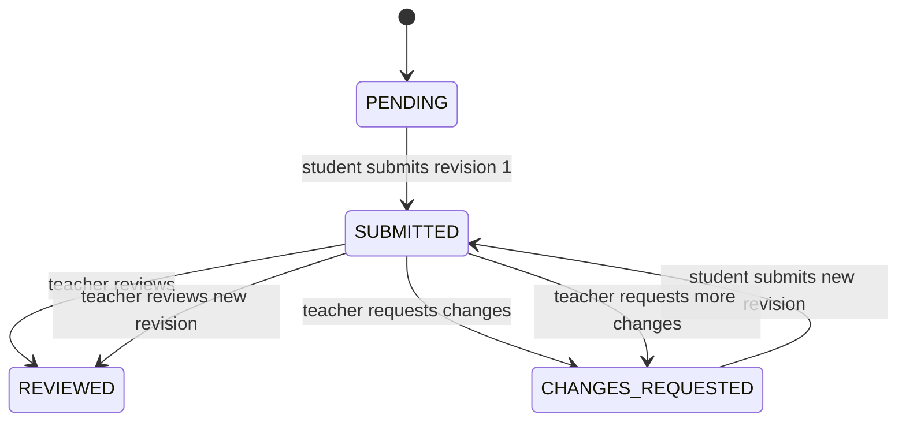

# Submissions workflow

Status: accepted MVP workflow; semantics are fixed by ADR-0013

## MVP behavior

Students can upload one or more files and an optional comment for a published assignment or document-based assessment. They can submit after the deadline. Late submissions remain valid and receive a recorded late flag. Teachers can review, comment, and request changes. No grades are produced.

## Accepted state model

The labels are workflow states, not grades or pass/fail judgments. `REVIEWED`
means the teacher completed review; it does not create a grade or score.

## Accepted persistence behavior

Treat a student’s work for one learning item as one logical submission with a revision history:

- the MVP does not persist server-side student drafts;
- submission creates an immutable revision snapshot;
- each revision records submitted time, effective deadline, late flag, files, and comment;
- teacher reviews attach to a specific revision;
- a change request allows a new revision without erasing prior work.

This supports corrections and an audit trail as accepted in [ADR-0013](../decisions/ADR-0013-submissions-and-storage-mvp-semantics.md).

## Deadline rules

- The server records the authoritative submission timestamp.
- Late status is computed against the item dueAt absolute instant.
- Client clock values are never authoritative.
- The API must permit late submission unless a future explicit policy says otherwise.
- Deadline changes after submission do not rewrite effectiveDueAt or isLate on historical revisions.

## File rules

- Multiple files per revision are supported.
- Each file is transferred independently through an authorized UploadIntent;
  the create-submission JSON mutation references only finalized opaque
  `fileObjectIds` (one to twenty).
- File metadata is associated with the immutable revision that submitted it.
- A teacher can download only after resource authorization.
- Replacing a file creates a new revision after CHANGES_REQUESTED; it must not silently mutate reviewed history.

## Notifications and audit events

Candidate events:

- `submission.submitted`;
- `submission.submitted_late`;
- `submission.reviewed`;
- `submission.changes_requested`;
- `submission.resubmitted`.

Each event should carry tenant, actor, resource, revision, and correlation identifiers. Notification delivery is asynchronous and must not be part of the transaction that determines whether a submission was accepted.

The accepted notification integration records the intent in the same
transaction as the submission or review mutation. `SUBMISSION_RECEIVED` and
`RESUBMISSION_RECEIVED` target active assigned teachers in-app. `REVIEWED` and
`CHANGES_REQUESTED` target the submitting student in-app and by operational
academic email. `COMMENTED` alone does not create a notification event. The
outbox persistence is durable with the mutation, but provider delivery is
outside the request transaction and cannot roll back the academic action.

## Deferred workflow decisions

- One logical submission with revisions versus multiple independent attempts.
- Whether students can save drafts before the first submission.
- Whether a teacher can edit or delete a review.
- Whether a change request requires a reason.
- Whether a student can submit a revision after the teacher marks `REVIEWED`.
- Tenant timezone and daylight-saving behavior for deadlines.
