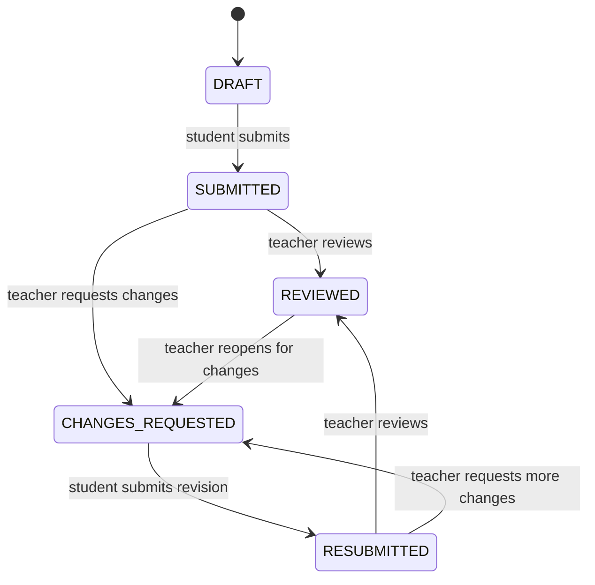

# Submissions workflow

Status: proposed workflow; revision semantics are an ADR candidate

## MVP behavior

Students can upload multiple files and an optional comment for an assignment or document-based assessment. They can submit after the deadline. Late submissions remain valid and receive a recorded late flag. Teachers can review, comment, and request changes. No grades are produced.

## Proposed state model

The labels are workflow states, not grades or pass/fail judgments. Whether `REVIEWED` means “accepted” or simply “teacher completed a review” must be agreed before UI copy is finalized.

## Proposed persistence behavior

Treat a student’s work for one learning item as one logical submission with a revision history:

- a draft can contain staged files and a comment;
- submission creates an immutable revision snapshot;
- each revision records submitted time, effective deadline, late flag, files, and comment;
- teacher reviews attach to a specific revision;
- a change request allows a new revision without erasing prior work.

This supports corrections and an audit trail, but it is a proposed design and must be confirmed in [ADR-0006](../decisions/ADR-0006-submission-revision-and-review-state.md).

## Deadline rules

- The server records the authoritative submission timestamp.
- Late status is computed against the item deadline and a tenant-approved timezone/clock policy.
- Client clock values are never authoritative.
- The API must permit late submission unless a future explicit policy says otherwise.
- Deadline changes after submission require an audit record and a policy for whether late status is recomputed.

## File rules

- Multiple files per revision are supported.
- File metadata is associated with the revision that submitted it.
- A teacher can download only after resource authorization.
- Replacing a file creates a new revision or draft change according to the approved policy; it must not silently mutate reviewed history.

## Notifications and audit events

Candidate events:

- `submission.submitted`;
- `submission.submitted_late`;
- `submission.reviewed`;
- `submission.changes_requested`;
- `submission.resubmitted`.

Each event should carry tenant, actor, resource, revision, and correlation identifiers. Notification delivery is asynchronous and must not be part of the transaction that determines whether a submission was accepted.

## Unresolved workflow decisions

- One logical submission with revisions versus multiple independent attempts.
- Whether students can save drafts before the first submission.
- Whether a teacher can edit or delete a review.
- Whether a change request requires a reason.
- Whether a student can submit a revision after the teacher marks `REVIEWED`.
- Tenant timezone and daylight-saving behavior for deadlines.
