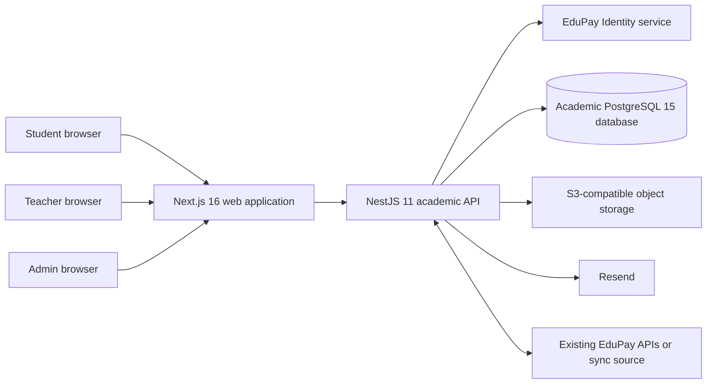

# System context

Status: proposed architecture constrained by project brief

## Context

EduPay Académico is a new multi-tenant academic product in the EduPay ecosystem. It has its own domain database and must interact with the existing EduPay platform and the new EduPay Identity service through explicit contracts.

## System responsibilities

### EduPay Académico web application

- Renders tenant-aware student, teacher, and administration experiences.
- Requests data through the academic API.
- Keeps authorization decisions on the server; client visibility is not a security boundary.
- Applies tenant theme/design tokens returned by configuration.

### EduPay Académico API

- Owns academic, learning, submission, notification, and academic audit behavior.
- Resolves tenant context from authenticated identity and membership context.
- Enforces resource authorization and validates input.
- Mediates all database, object-storage, notification, and EduPay integration access.

### EduPay Identity

- Owns users, credentials, sessions, refresh tokens, memberships, roles, invitations, and authentication auditing.
- Does not own students, teachers, courses, subjects, payments, or grades.

### Existing EduPay

- Remains the source of existing student/course information where an integration contract says so.
- Is never accessed by sharing tables or coupling Prisma schemas to its database.

## Interaction styles

- Browser-to-API calls are synchronous request/response operations.
- File bytes use controlled object-storage upload/download flows; the API remains the authorization decision point.
- Synchronization, notification delivery, and other retryable work should be asynchronous once the runtime decision is approved.
- Domain events should not be exposed as a substitute for authorization; every consumer rechecks the tenant and resource context it needs.

## Architectural boundaries

- Academic data and Identity data are separate ownership boundaries even if deployed together during development.
- The academic API should not accept a raw database connection to the existing EduPay database.
- External provider failures must degrade in a visible, recoverable way: a failed email should not lose a submission, and a failed sync should not disable manual academic operations.

## Unresolved topology choices

- Whether web, API, Identity, workers, and database run as separate production services or as a smaller initial topology.
- Queue/worker technology for notifications and synchronization.
- Deployment provider, regional placement, and operational ownership.

See [unresolved decisions](../governance/unresolved-decisions.md) and [deployment](deployment.md).
