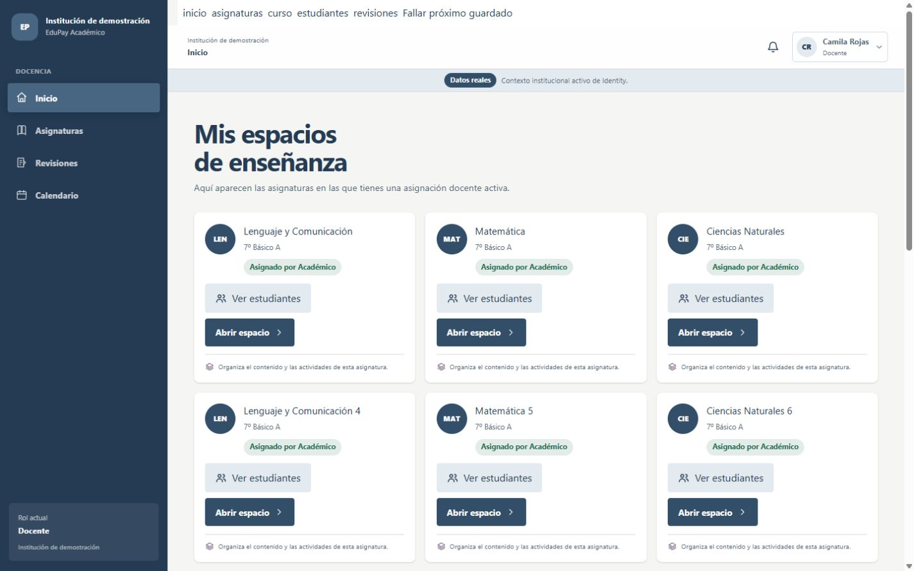
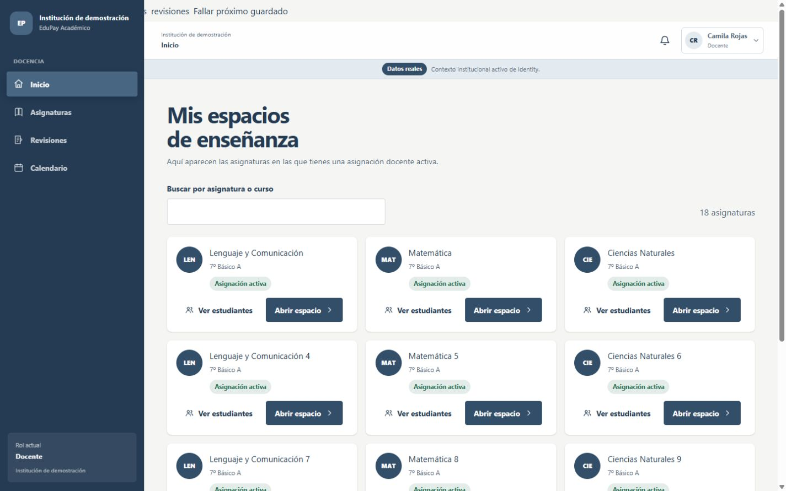
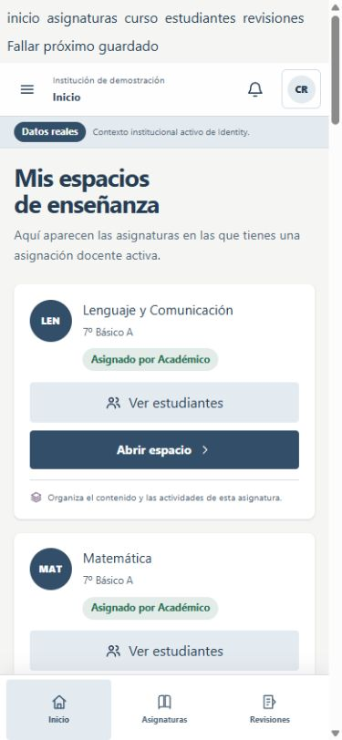
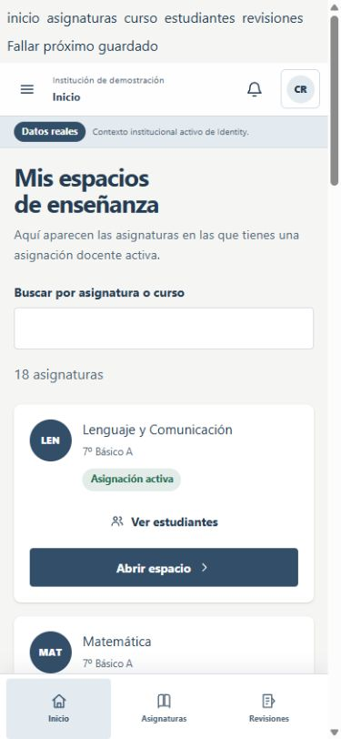

# Docencia: corte de trabajo cotidiano

Base: `origin/main` `79ebcd04476577e38013f76f57e4b7808833a817`.

## Recorrido y capacidades existentes

El profesor abre sus asignaturas autorizadas desde Inicio o Asignaturas. Cada espacio tiene unidades, contenidos, estados de borrador, programación y publicación, adjuntos, entregas, roster, revisión e historial. El constructor vigente permite crear, editar, duplicar, reordenar, archivar y restaurar según las protecciones del API. No se añadieron operaciones académicas nuevas.

## Cambios

- Inicio muestra seis asignaturas con acceso a la lista completa. Asignaturas permite buscar por curso o nombre y pasar páginas de 12; cada ficha lleva directamente al contenido o al roster.
- El roster conserva exclusivamente los estudiantes devueltos por el endpoint docente y añade búsqueda y páginas de 25. Los estados sin asignación, sin alumnos y sin coincidencias se distinguen.
- Revisiones permite acotar la cola por asignatura y curso cuando hay más de un contexto con actividades o evaluaciones.
- El constructor mantiene abiertos los formularios de unidad y contenido cuando falla el guardado, para corregir o reintentar con los datos escritos. Una confirmación sensible exitosa los cierra; se conservan la protección de salida con cambios, la detección de conflictos, el historial y la semántica de publicación. La edición de contenido publicado o programado abre el borrador de trabajo; el editor rápido queda para borradores. Sólo `STALE_REVISION` se presenta como conflicto de concurrencia: otros errores 409 muestran el mensaje del API y conservan el formulario.
- Al cambiar la membresía activa de Identity, el árbol docente se remonta y descarta estado local del tenant anterior. Las pantallas de DIE y Administración mantienen su ciclo de vida actual.
- Se añadieron estilos de controles para escritorio y móvil dentro del sistema visual existente.

El año académico no está disponible como etiqueta para el rol docente: `CourseSubject` contiene `course.academicYearId`, pero la consulta de años requiere `adminScope`. No se muestra un año inferido de fechas o IDs. Este dato requiere una decisión de contrato backend en un corte separado.

## Capturas sintéticas

Se capturó la misma lista con 18 asignaturas ficticias en un preview Vite local, aislado de Identity y del API. El preview y sus datos se retiraron antes del build final. El shell conserva la etiqueta productiva “Datos reales” por estar renderizado como componente real; el encabezado del preview y estos archivos identifican la sesión de captura como sintética.

| Tamaño                 | Antes (`origin/main`)                                                                                  | Después                                                                                                |
| ---------------------- | ------------------------------------------------------------------------------------------------------ | ------------------------------------------------------------------------------------------------------ |
| Escritorio, 1440 × 900 |  |  |
| Móvil, 390 × 844       |         |         |

## Validación y límites

Las capturas anteriores proceden de un preview con respuestas simuladas. Allí se recorrieron Inicio, Asignaturas, constructor, roster y Revisiones con 18 asignaturas ficticias y 32 alumnos; se comprobaron listas extensas, vacío, búsqueda, paginación y ancho móvil de 390 px sin desborde. Esas capturas no prueban integración.

Para la revisión de PR #22 se ejecutó el smoke existente `pilot-cross-service-smoke.mjs` con PostgreSQL descartable, Identity y API reales, cuentas y archivos sintéticos. Un harness temporal permitió abrir el frontend Next autenticado contra esos servicios; se retiró antes de cerrar el corte. En el navegador se verificaron Inicio con siete asignaturas asignadas (seis tarjetas y «Ver todas»), lista completa y búsqueda de la séptima, creación y activación de unidad, creación y publicación de actividad, edición mediante borrador de trabajo, entregas con dos revisiones, historial y tres adjuntos. El filtro de Revisiones cambió entre Lenguaje y Matemáticas, incluida una cola vacía. La misma cuenta tuvo dos membresías docentes: al cambiar de tenant sólo apareció Biología, una URL directa del primer tenant mostró «Asignatura no disponible», y al volver se recuperaron las siete asignaturas y se reinició el filtro. Una respuesta 403 real al guardar tras desactivar temporalmente la asignación docente conservó el formulario; al restaurarla, el reintento guardó. Todas las modificaciones de datos fueron en PostgreSQL descartable. El smoke integrado también descargó evidencia y rechazó accesos a recursos de otro tenant y a un docente no asignado. Las pruebas de componentes cubren búsqueda después de la primera página y descarte de respuestas anteriores al cambio de membresía.

Se ejecutaron contra PostgreSQL real los suites E2E de aprendizaje, dominio académico y entregas/almacenamiento: 30 pruebas aprobadas. El smoke completo de Identity + API concluyó con `PASS`. El navegador usó siete asignaturas del primer tenant y una del segundo con dos membresías docentes reales. El caso de año cerrado se verificó en API y PostgreSQL y en el formulario de unidad; la clasificación corregida del mensaje 409 se cubre mediante prueba de componente.

### Dependencia de publicación: política backend de año cerrado

El defecto [issue #23](https://github.com/Sherydans12/edupay-academico/issues/23) también existía en `origin/main`: `POST /api/v1/learning-units` aceptaba una escritura docente en año cerrado. La corrección y las pruebas PostgreSQL están aisladas en [PR #24](https://github.com/Sherydans12/edupay-academico/pull/24). La API debe publicarse antes que este frontend. Las lecturas y el historial siguen disponibles según la política existente.

El año académico continúa sin etiqueta legible para docentes. El build de release se verificó con bases HTTPS ficticias de proceso; la sesión integrada utilizó HTTP exclusivamente en loopback y el modo de desarrollo, sin cambiar la validación de producción ni crear `.env.local`.
