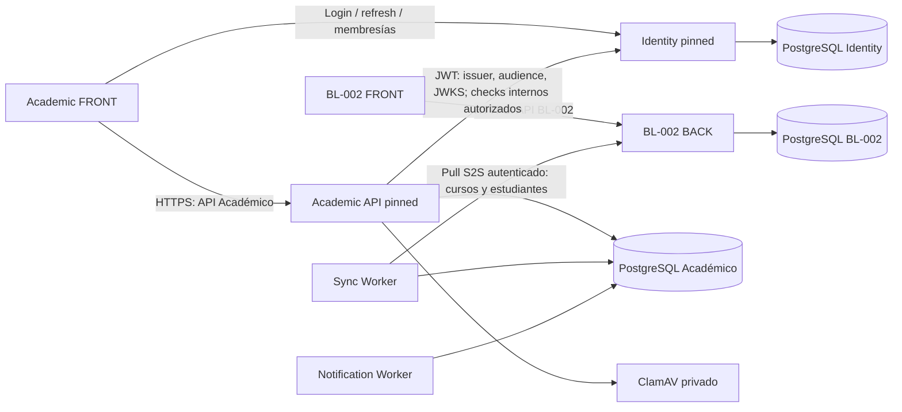

# Topología productiva EduPay

Verificado: **2026-09-24**. Estado: **módulo DIE desplegado; piloto sin configurar ni validar por el usuario; BL flags apagados**. Esta sección y el inventario estructurado representan el estado operativo más reciente. Las observaciones posteriores conservan su fecha y son evidencia histórica. Los ADR aceptados conservan autoridad sobre arquitectura y contratos.

## Estado operativo vigente — 2026-09-24

PR #10 de Académico y PR #12 de Identity se integraron después de aprobarse sus CI. El recovery point conjunto y las migraciones autorizadas se completaron. No se crearon usuarios STAFF, memberships, perfiles institucionales ni expedientes DIE reales.

| Componente | Código de release | Recurso / artefacto activo | Validación |
|---|---|---|---|
| Académico FRONT | `bd413666ebb3674dc791d8cb735bcea1aadbed62` (PR #10) | `cct0rtf5iku6fkd3t9hldnv4`; `ghcr.io/sherydans12/edupay-academico-web@sha256:c117c718352ede7220f4f685711d7df4bc88384b304bb19970d9379aa9fc0d81` | Running/healthy; dominio canónico y `/login` verificados; piloto no configurado |
| Académico API | `bd413666ebb3674dc791d8cb735bcea1aadbed62` (PR #10) | `iobfkpujjoa2kj5urbpnjvzi`; `ghcr.io/sherydans12/edupay-academico@sha256:902c5e2ed1aa59d4e2ca7e6a558aaa113585b3737fc6ed4346bb6597531ac393` | Running/healthy; ready/database/storage/malwareScanner OK; ledger 13 |
| Identity API | `93418b68eaf41976b4bc695039afcbc8eab4fdbc` (PR #12) | `0vrvqepcukwcubxga0narorf`; `ghcr.io/sherydans12/edupay-identity@sha256:960d326a9199881d54c7fc9611d052be77c0fbdceae4badebfe1208febe5aa01` | Running/healthy; health, JWKS y S2S comprobados; ledger 4, con tres migraciones históricas preservadas |
| Académico workers | Sin cambio | Recursos inventoryados; detenidos antes de la ventana DIE | Se conservaron detenidos; no se modificaron |
| BL-002 | Sin cambio por este release | Artefactos y flags existentes | Fuera de alcance; proyección BL apagada |

El cierre con ledger, checksums, recovery point y verificaciones es
[die-release-closeout-2026-09-24.md](die-release-closeout-2026-09-24.md). La guía de
primer uso está en [DIE-PILOT-GUIDE.md](DIE-PILOT-GUIDE.md).

## FRONT Académico activo y rollback conservado

El dominio canónico `academico.edupay.baselogic.cl` pertenece al recurso activo
`cct0rtf5iku6fkd3t9hldnv4`. El recurso previo `qf65r4ltig6jhb6t8dmv2qyw` quedó
`Exited`, sin dominios, retenido como rollback. El FRONT nuevo usa una imagen
preconstruida inmutable por digest, puerto 3000 y red compartida `coolify`; el
auto deploy permanece manual (`autoDeploy: false`). Es stateless y Coolify no
muestra almacenamiento persistente asociado.

La imagen `/deploy/Dockerfile.web` configura Docker `HEALTHCHECK` a
`GET http://127.0.0.1:3000/api/health`. `/login` es el smoke externo. La pantalla
Healthcheck de Coolify mostraba `Enable`, así que no hay healthcheck HTTP extra
de Coolify habilitado. La variante `www` aparece con DNS mismatch; el host
canónico tiene DNS OK.

Durante la lectura de Coolify, General mostró el aviso de formulario
`You have changes that haven't been saved yet` en ambos recursos. No se pulsó
`Save changes` ni `Reset`. Antes de un redeploy o rollback, revisar y reconciliar
esa pantalla con el estado desplegado; no guardar cambios en bloque. Para
recuperar el recurso anterior, primero retirar el host del candidato; después
asignarlo al anterior desde Coolify y confirmar un solo router/upstream Traefik
para el host. No ejecutar ambos recursos con el mismo dominio ni eliminar el
rollback.

## Referencia actual de Identity

Académico consume los endpoints internos de Identity a través de la red privada
Coolify. El digest desplegado de Identity es
`ghcr.io/sherydans12/edupay-identity@sha256:960d326a9199881d54c7fc9611d052be77c0fbdceae4badebfe1208febe5aa01`,
con base de artefacto `93418b68eaf41976b4bc695039afcbc8eab4fdbc`. Su ledger tiene
cuatro migraciones: las tres históricas, incluida la migración de recibos de
idempotencia ya aplicada, y `20260924000000_add_staff_role`. No reaplicar ni
resolver la migración histórica.

## Observación de release — 2026-09-14

Académico API ejecuta el hotfix
`ade7e6a6d831be94fd16ce2f0f4d95dce7d710c7` desde
`ghcr.io/sherydans12/edupay-academico@sha256:3eeb72cc73c314b1df72936dcfaaf5d3ce5873c1d81a08c8d23f3dfaafb37767`.
Los workers conservan el digest anterior verificado. BL FRONT continúa en
`502e6463464de0a54b440362a64da0c31450818f`; BL BACK está desplegado desde
`16e208af6a50e5703bc8f6edd51d7ff11b9c6381`, con imagen/manifiesto local
`sha256:85b202901f77a60cb120f0cc720b878f54e0e570da4d8c191d3040ee511ef64f`.
El deployment BL BACK es `nhwca59ptvsocugghdh0uiwv`. Su ledger quedó con 36
intentos, 28 aplicaciones efectivas, 8 reversiones históricas resueltas y 0
no resueltas; las únicas migraciones nuevas fueron
`20260903090000_add_tenant_canonical_mapping` y
`20260903113000_add_academic_financial_projection_shadow`. `RUN_MIGRATIONS=false`.
BL FRONT/BACK tienen auto deploy desactivado (`Manual deployments only`).
Producer, publisher y shadow permanecen apagados; no se agregaron mappings ni
credenciales S2S productivas nuevas. El candidato GHCR
`sha256:c19015e02821bcb5ede62b837ab33eba542d947f0de9a70d93bde89f5c5e1cf4`
fue validado localmente pero no se desplegó; su acceso desde la VPS sigue
pendiente por autorización del registry.

Este archivo y `coolify-inventory.json` se mantienen iguales en BL-002 y
Académico. Ante cualquier diferencia futura entre esta fotografía y Coolify,
hacer inventario read-only y reconciliar antes de desplegar. Un nombre, una rama
o un contenedor healthy por sí solos no identifican al producto correcto.

## Repositorios y responsabilidades

| Repositorio | Responsabilidad | Código productivo al cierre |
|---|---|---|
| [Sherydans12/BL-002-EduPay](https://github.com/Sherydans12/BL-002-EduPay) | Administración de pagos, alumnos/cursos de origen, autenticación administrativa y API de integración | FRONT: `502e6463464de0a54b440362a64da0c31450818f`; BACK: `16e208af6a50e5703bc8f6edd51d7ff11b9c6381` |
| [Sherydans12/edupay-academico](https://github.com/Sherydans12/edupay-academico) | Experiencia académica, autorización académica, aprendizaje, entregas, sincronización y notificaciones | Release DIE: FRONT/API `bd413666ebb3674dc791d8cb735bcea1aadbed62`; workers sin cambio y detenidos |
| [Sherydans12/edupay-identity](https://github.com/Sherydans12/edupay-identity) | Credenciales, sesiones, membresías, roles, activación, recuperación y auditoría de autenticación | Release DIE: fuente `93418b68eaf41976b4bc695039afcbc8eab4fdbc`; GHCR `sha256:960d326a9199881d54c7fc9611d052be77c0fbdceae4badebfe1208febe5aa01` |

BL-002 conserva su dominio de autenticación propio. No valida sesiones
administrativas con Identity ni debe consumir la API Académico como backend.
Académico usa Identity para autenticación y su propia API para datos académicos.

## Ubicación canónica en Coolify

- Consola: [coolify.baselogic.cl](https://coolify.baselogic.cl).
- Proyecto: **My first project**, UUID `p5gswqrr8ot1oaoxwytrpsho`.
- Entorno: **production**, UUID `oej046b1ozl6a1w329bx8zdd`.
- Servidor: **localhost**, UUID `h10grmpaqnhiissqexi1k4mu`, VPS `187.77.250.148`.
- Proxy: Traefik administrado por Coolify. Red compartida de acceso privado:
  `coolify`, además de las redes propias de cada stack.
- El antiguo proyecto **EduPay Académico** fue eliminado por estar vacío.
  No recrearlo ni buscar allí la producción.
- **Admission** y los demás sitios de My first project pertenecen a otros
  alcances. Compartir VPS no autoriza a detenerlos, cambiar sus bases o podarlos.

## Un dominio, un recurso

| Tipo / nombre Coolify | UUID | Dominio único | Puerto interno |
|---|---|---|---|
| Aplicación EDUPAY FRONT | `ktgdely86kx0by10p9cb91os` | `edupay.baselogic.cl` | 3000 |
| Aplicación EDUPAY BACK | `km0aljzabdiqtaixj9dsequu` | `api-edupay.baselogic.cl` | 3001 |
| Aplicación edupay-academico-web DIE | `cct0rtf5iku6fkd3t9hldnv4` | `academico.edupay.baselogic.cl` | 3000 |
| Aplicación edupay-academico-web (rollback retenido) | `qf65r4ltig6jhb6t8dmv2qyw` | Ninguno; detenido | 3000 |
| Servicio edupay-academico-pinned | `iobfkpujjoa2kj5urbpnjvzi` | `academico-api.edupay.baselogic.cl` | 3001 |
| Servicio edupay-identity-pinned | `0vrvqepcukwcubxga0narorf` | `identity.edupay.baselogic.cl` | 3000 |
| Servicio edupay-academico-notification-worker-pinned | `nn8yrhitex2r6squev0auwrs` | Ninguno | Sin publicación |
| Servicio edupay-academico-sync-worker-pinned | `r8mtn1xqtex96j4a8wu5hae6` | Ninguno | Sin publicación |
| Aplicación clamav | `ttrrmrkod9hmqo68er6q2ghs` | Ninguno | Privado |

**Nunca asignar edupay.baselogic.cl a Académico ni
academico.edupay.baselogic.cl a BL-002.** Verificar también labels efectivos
del contenedor y upstreams Traefik: un dominio vacío en Coolify no elimina por
sí solo una ruta vieja de un contenedor anterior.

Los nombres de los contenedores de aplicaciones tienen sufijos por deployment;
usar UUID como identidad estable, no un sufijo antiguo. No añadir puertos del
host para resolver fallos de comunicación privada.

## Imágenes y build

La API Académico ejecuta exactamente:

`ghcr.io/sherydans12/edupay-academico@sha256:902c5e2ed1aa59d4e2ca7e6a558aaa113585b3737fc6ed4346bb6597531ac393`

El Academic FRONT ejecuta el artefacto inmutable:

`ghcr.io/sherydans12/edupay-academico-web@sha256:c117c718352ede7220f4f685711d7df4bc88384b304bb19970d9379aa9fc0d81`

Ambos workers conservan exactamente:

`ghcr.io/sherydans12/edupay-academico@sha256:b3e45d7c0afad1729947bdea6fe16d517c3dc9060891b38b313ce14a0548084a`

BL BACK fue construido por Coolify desde `16e208af6a50e5703bc8f6edd51d7ff11b9c6381`
con `/backend/Dockerfile`; el digest `85b202…` aparece como digest de
manifiesto/repositorio y también como ID de la imagen local inspeccionada. La
imagen de rollback conservada es `sha256:0b15f903be869ac7467b4d23f6ca25f11c9689575291310e90c42d5be0cc3dab`,
etiquetada con `502e6463464de0a54b440362a64da0c31450818f`. El acceso al
artefacto GHCR `c19015…` queda como pendiente operativo y no se registran
credenciales.

Identity ejecuta exactamente:

`ghcr.io/sherydans12/edupay-identity@sha256:960d326a9199881d54c7fc9611d052be77c0fbdceae4badebfe1208febe5aa01`

Un digest de manifiesto, el ID local de imagen y un SHA Git son identificadores
distintos. No sustituirlos entre sí ni cambiar el pinned a `latest`.

| Recurso | Rama configurada | Base / Dockerfile Coolify | Target / health |
|---|---|---|---|
| BL-002 FRONT | `main`, SHA fijado arriba | `/frontend` + `/Dockerfile` | `runner`; HTTP 127.0.0.1:3000/login |
| BL-002 BACK | `main`, SHA fijado arriba | `/backend` + `/Dockerfile` | Etapa final; health público /api/v1/health |
| Academic FRONT activo | Imagen GHCR fijada por digest | aplicación stateless; no monta volumen | Docker healthcheck `GET 127.0.0.1:3000/api/health`; smoke externo `/login` |

El Academic FRONT activo escucha en todas las interfaces dentro del contenedor
mediante HOSTNAME; el healthcheck incluido en la imagen usa loopback. El recurso
anterior conserva su configuración de build como ruta de rollback.

## Bases y persistencia

| Propietario | Recurso Coolify | UUID | Imagen observada / volumen |
|---|---|---|---|
| BL-002 BACK | postgresql-database-EDUPAY | `dms5i3e0i5t4kyh7h683mi7v` | postgres:18-alpine; `postgres-data-dms5i3e0i5t4kyh7h683mi7v` → /var/lib/postgresql |
| Académico API y workers | academico-db | `v5w9hacwtftulf4m46l1rn2g` | postgres:15-alpine; `postgres-data-v5w9hacwtftulf4m46l1rn2g` → /var/lib/postgresql/data |
| Identity | identity-db | `bluypktxta8uisbrfzu6p9pw` | postgres:15-alpine; `postgres-data-bluypktxta8uisbrfzu6p9pw` → /var/lib/postgresql/data |

Las tres conexiones se comprobaron relacionando internamente el hostname de la
configuración con el contenedor, sin imprimir DATABASE_URL. No hay tablas,
credenciales, consultas SQL ni claves foráneas compartidas entre productos.
Cada backend usa exclusivamente su base. El Sync Worker escribe en Académico y
lee BL-002 por HTTP, nunca conectándose a PostgreSQL BL-002.

Los frontends no tienen acceso a bases. BACK BL-002 conserva el bind
`/edupay-backend-uploads` → `/usr/src/app/uploads`. Académico conserva su
almacenamiento privado, STORAGE_ROOT y STORAGE_TEMP_ROOT; verificar sus montajes
reales antes de recrear el servicio. ClamAV es una dependencia de la API para
análisis de archivos; sus originales de evidencia mantienen la política del ADR
de almacenamiento. No reemplazar ni inicializar volúmenes en un redeploy.

La fotografía histórica del 2026-09-14 incluía **11 contenedores de
aplicación/dependencia EduPay healthy**, contando PostgreSQL BL-002. Los
anteriores recuentos de 10 tras la limpieza cubrían los recursos de la
remediación y omitían esa base preexistente. Para el estado actual, usar el
inventario fechado; los workers Académico se mantuvieron detenidos durante el
release DIE. Coolify, su base, proxy y otros proyectos son infraestructura
adicional, no instancias duplicadas de EduPay.

## Cómo se conectan

- Base del bundle BL-002: `https://api-edupay.baselogic.cl/api`.
- Base del bundle Académico: `https://academico-api.edupay.baselogic.cl/api/v1`.
  La ruta versionada es obligatoria en el código publicado; `/api` no equivale
  a `/api/v1` para este frontend.
- Identity público: `https://identity.edupay.baselogic.cl`.
  JWT/JWKS, cookies seguras y CORS pertenecen al flujo Identity–Académico.
  Verificar el origen exacto `https://academico.edupay.baselogic.cl`.
- Integración BL-002: GET `/api/v1/integrations/academico/snapshot`,
  `/snapshot/complete`, `/courses` y `/students`, bajo ese mismo prefijo.
  Contrato v1, token S2S dedicado, allowlist de tenants y cursores firmados.
  La dirección base del Sync Worker se comprobó contra el backend público BL-002.
- BL-002 es fuente administrativa de cursos, estudiantes y curso actual.
  Académico mantiene pedagogía, docentes, asignaturas, entregas e historia.
  Identity mantiene autenticación. Un tenant de origen BL-002 no es una
  autorización ni una equivalencia automática con el tenant canónico:
  el mapeo es explícito y controlado en servidor.
- El worker sano y la presencia del token no prueban que cada tenant tenga una
  sincronización de negocio completa. Auditar runs, conflictos y cursores sin
  leer ni publicar payloads personales antes de cerrar una nueva fase de sync.

## Configuración: solo nombres

| Recurso | Nombres que deben comprobarse | Regla |
|---|---|---|
| BL FRONT | NEXT_PUBLIC_API_URL, JWT_SECRET | Base propia compilada; JWT_SECRET solo servidor y coherente con BACK |
| BL BACK | DATABASE_URL, JWT_SECRET, FRONTEND_URL, RUN_MIGRATIONS | Conexión propia; migración automática desactivada en producción |
| BL integración | EDUPAY_ACADEMICO_INTEGRATION_TOKEN, EDUPAY_ACADEMICO_ALLOWED_TENANTS, EDUPAY_ACADEMICO_CURSOR_SECRET | S2S y tenant; nunca credenciales del navegador |
| Academic FRONT | NEXT_PUBLIC_API_BASE_URL, NEXT_PUBLIC_IDENTITY_BASE_URL, HOSTNAME, PORT | Solo las bases públicas correctas en el bundle |
| Academic API | DATABASE_URL, IDENTITY_ISSUER, IDENTITY_AUDIENCE, IDENTITY_JWKS_URI, IDENTITY_INTERNAL_BASE_URL, IDENTITY_INTERNAL_SERVICE_TOKEN, ACADEMIC_TRUSTED_WEB_ORIGINS | Identidad validada, CORS exacto y base privada propia |
| API / Sync | EDUPAY_INTEGRATION_BASE_URL, EDUPAY_INTEGRATION_TOKEN y EDUPAY_SYNC_* | Fuente HTTP BL-002; datos de sincronización en base Académico |
| API / Notification | ACADEMIC_EMAIL_MODE, ACADEMIC_RESEND_API_KEY, NOTIFICATION_* | Entrega y reintentos del outbox Académico |
| API / almacenamiento | STORAGE_ROOT, STORAGE_TEMP_ROOT, ACADEMIC_MALWARE_SCANNER, ACADEMIC_CLAMAV_HOST, ACADEMIC_CLAMAV_PORT | Volúmenes privados y scanner accesible |

Nombres heredados presentes en BL FRONT (NEXT_PUBLIC_API_BASE_URL y
NEXT_PUBLIC_IDENTITY_BASE_URL) no son el contrato de configuración de su código
502e646. No usarlos para configurar su API ni inferir integración con Identity;
el bundle efectivo fue comprobado contra BL-002. Su eventual retirada exige
comparar el código y el artefacto, no cambiar valores a ciegas.

Guardar secretos exclusivamente en mecanismos protegidos. No adjuntar dumps,
.env, tokens, cookies, contraseñas, claves privadas ni salidas completas de
docker inspect o logs a Git, PRs o documentos. No hay valores secretos aquí.

## Referencias

- [Inventario estructurado](coolify-inventory.json).
- [Runbook de cambios y recuperación](RUNBOOK.md).
- [Cierre de fase, evidencia y límites](PHASE-CLOSEOUT.md).
