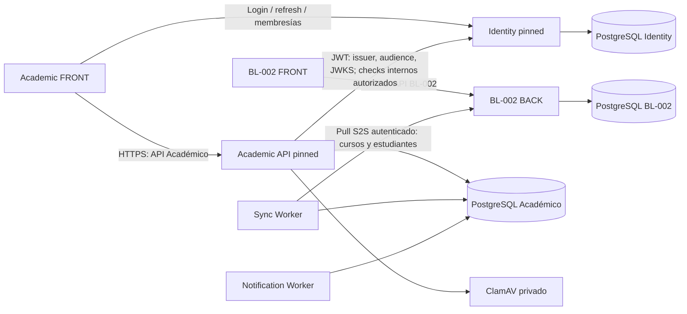

# Topología productiva EduPay

Verificado: **2026-09-14**, después de remediación, recuperación del frontend y
validación del release con flags apagados. Estado funcional:
**RELEASE_DEPLOYED_FLAGS_OFF**.
Esta es la referencia operativa vigente. Los ADR aceptados conservan autoridad
sobre arquitectura y contratos; los runbooks anteriores son evidencia histórica.

## Reconciliación documental vigente — 2026-09-22

Esta sección separa integración en Git, despliegue observado y validación del
usuario. El `main` de Académico integra PR #7 (merge
`10b84fd12ddc76221c862589267067d5fb7e5cbd`) y PR #8 (merge
`8b9805af417635a7ebe3c3ac2e1f23f3b2f16ead`); CI de `main` fue aprobado. Eso no
prueba que Coolify haya reconstruido el FRONT. El código realmente desplegado
no se sustituye en esta fotografía por el SHA de `main`.

| Componente | Integrado / referencia de código | Despliegue o artefacto conocido | Estado de validación |
|---|---|---|---|
| Académico FRONT | `main` en `8b9805af417635a7ebe3c3ac2e1f23f3b2f16ead`; PR #7 y Onboarding 2 integrados | Evidencia de Cut 1: fuente `e844f5b54291af7c7027498c8972fa90cb46783d`, imagen `qf65r4ltig6jhb6t8dmv2qyw:e844f5b54291af7c7027498c8972fa90cb46783d`, manifiesto `sha256:ae93b9646016860af02fcc332ff6e0b0fedd9de548e428b427c462a7bcdf1a13`; la fotografía base también conserva deployment Coolify `wxgimhdhkeolqstf35psgwvh` y SHA estable `4f5ad2839e08e561e0335f6e4fdedfe448f15415` | Integrado; FRONT de PR #8 pendiente de redeploy y validación de usuario |
| Académico API | Hotfix y primer corte ya integrados en `main` | Último inventario canónico: código `ade7e6a6d831be94fd16ce2f0f4d95dce7d710c7`, imagen `ghcr.io/sherydans12/edupay-academico@sha256:3eeb72cc73c314b1df72936dcfaaf5d3ce5873c1d81a08c8d23f3dfaafb37767`; Cut 1 documentó además `sha256:89bb5a7a54100a0bcd1d1fc239b2c56309a243f7914105fb4e245a7ee2732c18` | Desplegado previamente; este cierre no autoriza ni requiere redeploy API |
| Académico workers | Código `b2f489f3bfbb67da8fc8ff71be7ea551e1de27c9` | `ghcr.io/sherydans12/edupay-academico@sha256:b3e45d7c0afad1729947bdea6fe16d517c3dc9060891b38b313ce14a0548084a` | Desplegado; fuera del corte documental |
| Identity | Referencia de `origin/main` `0616adbd3226b97f84381f65f3bb9fe5fe03cee1`; recuperación/plantilla documentadas en sus merges | Evidencia posterior de plantilla: `ghcr.io/sherydans12/edupay-identity@sha256:6733d04b53c87145429927b2d9a37e2fe7d44d73314d857c6a03bd8e67f64103`; el inventario histórico conserva `b38849be78fee492f68f2d0e99cff3b69a08415a` / `sha256:eb35930f4fb0358d891c50c57e301d47fb033b9d9a0b53284fea0b68e73aa7f8` | Recuperación y plantilla confirmadas por el usuario; no modificar Identity |
| BL-002 | `origin/main` consultado en `d3e40da0bcf893e8d02f2c23d7c79a4d46b8071f` | Mapping desplegado desde `04687aa8c5249ad1f9be94c7ad62099fb41d5d6c`; BACK manifest `sha256:4b0f403a51bc45b3ce229bf01d97e108804d3326765f1e3f4e788834bac76a1a`, FRONT manifest `sha256:9b2193b1783b764ae2ff304f7ccd14154af6cb37277359d23cb0215301e3b2d9`; 0 escrituras de mapping | Acceso confirmado; sin asignaciones reales; fuera de este cambio |
| Registry | No es un SHA de aplicación | GHCR privado operativo para los artefactos runtime fijados por digest; no se registran credenciales. El candidato histórico `sha256:c19015e02821bcb5ede62b837ab33eba542d947f0de9a70d93bde89f5c5e1cf4` sigue sin equivaler a despliegue | Operativo; no confundir disponibilidad del registry con promoción de una imagen |

La diferencia entre el registro histórico del FRONT (`4f5ad283…`/deployment
`wxgim…`) y el artefacto explícito de Cut 1 (`e844f5b…`/manifiesto
`ae93…`) queda conservada como evidencia separada. Antes de un rollback se debe
confirmar en Coolify cuál es el deployment vigente y su imagen; ninguno de esos
identificadores se reemplaza por `8b9805af…` sin evidencia de despliegue.

Onboarding 1 fue desplegado y el usuario confirmó el indicador en lectura. Su
`READY` sigue significando únicamente estructura base preparada. PR #7 y
Onboarding 2 están integrados, pero el FRONT de ese corte sigue pendiente de
redeploy y de comprobación de navegación/lectura.

## Instrucción concreta para el redeploy pendiente del FRONT

El usuario debe actuar sólo sobre el recurso Coolify
`qf65r4ltig6jhb6t8dmv2qyw` (`academico.edupay.baselogic.cl`):

1. Seleccionar `main` en el candidato aprobado
   `8b9805af417635a7ebe3c3ac2e1f23f3b2f16ead`; no conservar un pin anterior ni
   confundir el SHA Git con un deployment o un digest.
2. Mantener `/deploy/Dockerfile.web`, target `runtime`, puerto `3000` y health
   `GET /login`.
3. Conservar exactamente `NEXT_PUBLIC_API_BASE_URL=https://academico-api.edupay.baselogic.cl/api/v1`
   y `NEXT_PUBLIC_IDENTITY_BASE_URL=https://identity.edupay.baselogic.cl`.
4. Ejecutar sólo FRONT, sin migraciones ni cambios en API, workers, Identity,
   BL, mappings, flags o secretos. Auto deploy permanece manual.
5. Tras el deploy, comprobar sólo lecturas: `/login`, navegación a
   `/docente/asignaturas/.../estudiantes`, `/administracion/estructura`, el
   indicador autorizado de TENANT_ADMIN y cambio de contexto. No crear ni
   activar años, cursos, asignaturas o asociaciones reales.

Para rollback, identificar tres cosas por separado: deployment Coolify UUID
`wxgimhdhkeolqstf35psgwvh` (registro histórico del FRONT), SHA de código
`4f5ad2839e08e561e0335f6e4fdedfe448f15415` y, como artefacto conocido de Cut 1,
manifiesto `sha256:ae93b9646016860af02fcc332ff6e0b0fedd9de548e428b427c462a7bcdf1a13`
de la imagen etiquetada con `e844f5b…`. Confirmar en Coolify que esa relación
sigue disponible antes de usarla; no llamar “deployment” a un SHA Git y no
hacer rollback cruzado si sólo falla FRONT.

## Observación de release — 2026-09-14

Académico API ejecuta el hotfix
`ade7e6a6d831be94fd16ce2f0f4d95dce7d710c7` desde
`ghcr.io/sherydans12/edupay-academico@sha256:3eeb72cc73c314b1df72936dcfaaf5d3ce5873c1d81a08c8d23f3dfaafb37767`.
Los workers conservan el digest anterior verificado. BL FRONT continúa en
`502e6463464de0a54b440362a64da0c31450818f`; BL BACK está desplegado desde
`16e208af6a50e5703bc8f6edd51d7ff11b9c6381`, con imagen/manifiesto local
`sha256:85b202901f77a60cb120f0cc720b878f54e0e570da4d8c191d3040ee511ef64f`.
El deployment BL BACK es `nhwca59ptvsocugghdh0uiwv`. Su ledger quedó con 36
intentos, 28 aplicaciones efectivas, 8 reversiones históricas resueltas y 0
no resueltas; las únicas migraciones nuevas fueron
`20260903090000_add_tenant_canonical_mapping` y
`20260903113000_add_academic_financial_projection_shadow`. `RUN_MIGRATIONS=false`.
BL FRONT/BACK tienen auto deploy desactivado (`Manual deployments only`).
Producer, publisher y shadow permanecen apagados; no se agregaron mappings ni
credenciales S2S productivas nuevas. El candidato GHCR
`sha256:c19015e02821bcb5ede62b837ab33eba542d947f0de9a70d93bde89f5c5e1cf4`
fue validado localmente pero no se desplegó; su acceso desde la VPS sigue
pendiente por autorización del registry.

Este archivo y `coolify-inventory.json` se mantienen iguales en BL-002 y
Académico. Ante cualquier diferencia futura entre esta fotografía y Coolify,
hacer inventario read-only y reconciliar antes de desplegar. Un nombre, una rama
o un contenedor healthy por sí solos no identifican al producto correcto.

## Repositorios y responsabilidades

| Repositorio | Responsabilidad | Código productivo al cierre |
|---|---|---|
| [Sherydans12/BL-002-EduPay](https://github.com/Sherydans12/BL-002-EduPay) | Administración de pagos, alumnos/cursos de origen, autenticación administrativa y API de integración | FRONT: `502e6463464de0a54b440362a64da0c31450818f`; BACK: `16e208af6a50e5703bc8f6edd51d7ff11b9c6381` |
| [Sherydans12/edupay-academico](https://github.com/Sherydans12/edupay-academico) | Experiencia académica, autorización académica, aprendizaje, entregas, sincronización y notificaciones | FRONT: `4f5ad2839e08e561e0335f6e4fdedfe448f15415`; API: `ade7e6a6d831be94fd16ce2f0f4d95dce7d710c7`; workers: `b2f489f3bfbb67da8fc8ff71be7ea551e1de27c9` |
| [Sherydans12/edupay-identity](https://github.com/Sherydans12/edupay-identity) | Credenciales, sesiones, membresías, roles, activación, recuperación y auditoría de autenticación | OCI `b38849be78fee492f68f2d0e99cff3b69a08415a` |

BL-002 conserva su dominio de autenticación propio. No valida sesiones
administrativas con Identity ni debe consumir la API Académico como backend.
Académico usa Identity para autenticación y su propia API para datos académicos.

## Ubicación canónica en Coolify

- Consola: [coolify.baselogic.cl](https://coolify.baselogic.cl).
- Proyecto: **My first project**, UUID `p5gswqrr8ot1oaoxwytrpsho`.
- Entorno: **production**, UUID `oej046b1ozl6a1w329bx8zdd`.
- Servidor: **localhost**, UUID `h10grmpaqnhiissqexi1k4mu`, VPS `187.77.250.148`.
- Proxy: Traefik administrado por Coolify. Red compartida de acceso privado:
  `coolify`, además de las redes propias de cada stack.
- El antiguo proyecto **EduPay Académico** fue eliminado por estar vacío.
  No recrearlo ni buscar allí la producción.
- **Admission** y los demás sitios de My first project pertenecen a otros
  alcances. Compartir VPS no autoriza a detenerlos, cambiar sus bases o podarlos.

## Un dominio, un recurso

| Tipo / nombre Coolify | UUID | Dominio único | Puerto interno |
|---|---|---|---|
| Aplicación EDUPAY FRONT | `ktgdely86kx0by10p9cb91os` | `edupay.baselogic.cl` | 3000 |
| Aplicación EDUPAY BACK | `km0aljzabdiqtaixj9dsequu` | `api-edupay.baselogic.cl` | 3001 |
| Aplicación edupay-academico-web | `qf65r4ltig6jhb6t8dmv2qyw` | `academico.edupay.baselogic.cl` | 3000 |
| Servicio edupay-academico-pinned | `iobfkpujjoa2kj5urbpnjvzi` | `academico-api.edupay.baselogic.cl` | 3001 |
| Servicio edupay-identity-pinned | `0vrvqepcukwcubxga0narorf` | `identity.edupay.baselogic.cl` | 3000 |
| Servicio edupay-academico-notification-worker-pinned | `nn8yrhitex2r6squev0auwrs` | Ninguno | Sin publicación |
| Servicio edupay-academico-sync-worker-pinned | `r8mtn1xqtex96j4a8wu5hae6` | Ninguno | Sin publicación |
| Aplicación clamav | `ttrrmrkod9hmqo68er6q2ghs` | Ninguno | Privado |

**Nunca asignar edupay.baselogic.cl a Académico ni
academico.edupay.baselogic.cl a BL-002.** Verificar también labels efectivos
del contenedor y upstreams Traefik: un dominio vacío en Coolify no elimina por
sí solo una ruta vieja de un contenedor anterior.

Los nombres de los contenedores de aplicaciones tienen sufijos por deployment;
usar UUID como identidad estable, no un sufijo antiguo. No añadir puertos del
host para resolver fallos de comunicación privada.

## Imágenes y build

La API Académico ejecuta exactamente:

`ghcr.io/sherydans12/edupay-academico@sha256:3eeb72cc73c314b1df72936dcfaaf5d3ce5873c1d81a08c8d23f3dfaafb37767`

Ambos workers conservan exactamente:

`ghcr.io/sherydans12/edupay-academico@sha256:b3e45d7c0afad1729947bdea6fe16d517c3dc9060891b38b313ce14a0548084a`

BL BACK fue construido por Coolify desde `16e208af6a50e5703bc8f6edd51d7ff11b9c6381`
con `/backend/Dockerfile`; el digest `85b202…` aparece como digest de
manifiesto/repositorio y también como ID de la imagen local inspeccionada. La
imagen de rollback conservada es `sha256:0b15f903be869ac7467b4d23f6ca25f11c9689575291310e90c42d5be0cc3dab`,
etiquetada con `502e6463464de0a54b440362a64da0c31450818f`. El acceso al
artefacto GHCR `c19015…` queda como pendiente operativo y no se registran
credenciales.

Identity conserva exactamente:

`ghcr.io/sherydans12/edupay-identity@sha256:eb35930f4fb0358d891c50c57e301d47fb033b9d9a0b53284fea0b68e73aa7f8`

Un digest de manifiesto, el ID local de imagen y un SHA Git son identificadores
distintos. No sustituirlos entre sí ni cambiar el pinned a `latest`.

| Recurso | Rama configurada | Base / Dockerfile Coolify | Target / health |
|---|---|---|---|
| BL-002 FRONT | `main`, SHA fijado arriba | `/frontend` + `/Dockerfile` | `runner`; HTTP 127.0.0.1:3000/login |
| BL-002 BACK | `main`, SHA fijado arriba | `/backend` + `/Dockerfile` | Etapa final; health público /api/v1/health |
| Academic FRONT | `codex/production-latest-web-recovery`, SHA fijado arriba | `/` + `/deploy/Dockerfile.web` | `runtime`; HTTP 127.0.0.1:3000/login |

Conservar los comandos del recurso validado. Academic FRONT escucha en todas
las interfaces dentro del contenedor mediante HOSTNAME; su health usa loopback.
No vaciar el target sin verificar persistencia: Coolify conservó un target
anterior al intentar hacerlo.

## Bases y persistencia

| Propietario | Recurso Coolify | UUID | Imagen observada / volumen |
|---|---|---|---|
| BL-002 BACK | postgresql-database-EDUPAY | `dms5i3e0i5t4kyh7h683mi7v` | postgres:18-alpine; `postgres-data-dms5i3e0i5t4kyh7h683mi7v` → /var/lib/postgresql |
| Académico API y workers | academico-db | `v5w9hacwtftulf4m46l1rn2g` | postgres:15-alpine; `postgres-data-v5w9hacwtftulf4m46l1rn2g` → /var/lib/postgresql/data |
| Identity | identity-db | `bluypktxta8uisbrfzu6p9pw` | postgres:15-alpine; `postgres-data-bluypktxta8uisbrfzu6p9pw` → /var/lib/postgresql/data |

Las tres conexiones se comprobaron relacionando internamente el hostname de la
configuración con el contenedor, sin imprimir DATABASE_URL. No hay tablas,
credenciales, consultas SQL ni claves foráneas compartidas entre productos.
Cada backend usa exclusivamente su base. El Sync Worker escribe en Académico y
lee BL-002 por HTTP, nunca conectándose a PostgreSQL BL-002.

Los frontends no tienen acceso a bases. BACK BL-002 conserva el bind
`/edupay-backend-uploads` → `/usr/src/app/uploads`. Académico conserva su
almacenamiento privado, STORAGE_ROOT y STORAGE_TEMP_ROOT; verificar sus montajes
reales antes de recrear el servicio. ClamAV es una dependencia de la API para
análisis de archivos; sus originales de evidencia mantienen la política del ADR
de almacenamiento. No reemplazar ni inicializar volúmenes en un redeploy.

El inventario completo incluye **11 contenedores de aplicación/dependencia
EduPay healthy**, contando PostgreSQL BL-002. Los anteriores recuentos de 10
tras la limpieza cubrían los recursos de la remediación y omitían esa base
preexistente. Coolify, su base, proxy y otros proyectos son infraestructura
adicional, no instancias duplicadas de EduPay.

## Cómo se conectan

- Base del bundle BL-002: `https://api-edupay.baselogic.cl/api`.
- Base del bundle Académico: `https://academico-api.edupay.baselogic.cl/api/v1`.
  La ruta versionada es obligatoria en el código publicado; `/api` no equivale
  a `/api/v1` para este frontend.
- Identity público: `https://identity.edupay.baselogic.cl`.
  JWT/JWKS, cookies seguras y CORS pertenecen al flujo Identity–Académico.
  Verificar el origen exacto `https://academico.edupay.baselogic.cl`.
- Integración BL-002: GET `/api/v1/integrations/academico/snapshot`,
  `/snapshot/complete`, `/courses` y `/students`, bajo ese mismo prefijo.
  Contrato v1, token S2S dedicado, allowlist de tenants y cursores firmados.
  La dirección base del Sync Worker se comprobó contra el backend público BL-002.
- BL-002 es fuente administrativa de cursos, estudiantes y curso actual.
  Académico mantiene pedagogía, docentes, asignaturas, entregas e historia.
  Identity mantiene autenticación. Un tenant de origen BL-002 no es una
  autorización ni una equivalencia automática con el tenant canónico:
  el mapeo es explícito y controlado en servidor.
- El worker sano y la presencia del token no prueban que cada tenant tenga una
  sincronización de negocio completa. Auditar runs, conflictos y cursores sin
  leer ni publicar payloads personales antes de cerrar una nueva fase de sync.

## Configuración: solo nombres

| Recurso | Nombres que deben comprobarse | Regla |
|---|---|---|
| BL FRONT | NEXT_PUBLIC_API_URL, JWT_SECRET | Base propia compilada; JWT_SECRET solo servidor y coherente con BACK |
| BL BACK | DATABASE_URL, JWT_SECRET, FRONTEND_URL, RUN_MIGRATIONS | Conexión propia; migración automática desactivada en producción |
| BL integración | EDUPAY_ACADEMICO_INTEGRATION_TOKEN, EDUPAY_ACADEMICO_ALLOWED_TENANTS, EDUPAY_ACADEMICO_CURSOR_SECRET | S2S y tenant; nunca credenciales del navegador |
| Academic FRONT | NEXT_PUBLIC_API_BASE_URL, NEXT_PUBLIC_IDENTITY_BASE_URL, HOSTNAME, PORT | Solo las bases públicas correctas en el bundle |
| Academic API | DATABASE_URL, IDENTITY_ISSUER, IDENTITY_AUDIENCE, IDENTITY_JWKS_URI, IDENTITY_INTERNAL_BASE_URL, IDENTITY_INTERNAL_SERVICE_TOKEN, ACADEMIC_TRUSTED_WEB_ORIGINS | Identidad validada, CORS exacto y base privada propia |
| API / Sync | EDUPAY_INTEGRATION_BASE_URL, EDUPAY_INTEGRATION_TOKEN y EDUPAY_SYNC_* | Fuente HTTP BL-002; datos de sincronización en base Académico |
| API / Notification | ACADEMIC_EMAIL_MODE, ACADEMIC_RESEND_API_KEY, NOTIFICATION_* | Entrega y reintentos del outbox Académico |
| API / almacenamiento | STORAGE_ROOT, STORAGE_TEMP_ROOT, ACADEMIC_MALWARE_SCANNER, ACADEMIC_CLAMAV_HOST, ACADEMIC_CLAMAV_PORT | Volúmenes privados y scanner accesible |

Nombres heredados presentes en BL FRONT (NEXT_PUBLIC_API_BASE_URL y
NEXT_PUBLIC_IDENTITY_BASE_URL) no son el contrato de configuración de su código
502e646. No usarlos para configurar su API ni inferir integración con Identity;
el bundle efectivo fue comprobado contra BL-002. Su eventual retirada exige
comparar el código y el artefacto, no cambiar valores a ciegas.

Guardar secretos exclusivamente en mecanismos protegidos. No adjuntar dumps,
.env, tokens, cookies, contraseñas, claves privadas ni salidas completas de
docker inspect o logs a Git, PRs o documentos. No hay valores secretos aquí.

## Referencias

- [Inventario estructurado](coolify-inventory.json).
- [Runbook de cambios y recuperación](RUNBOOK.md).
- [Cierre de fase, evidencia y límites](PHASE-CLOSEOUT.md).
